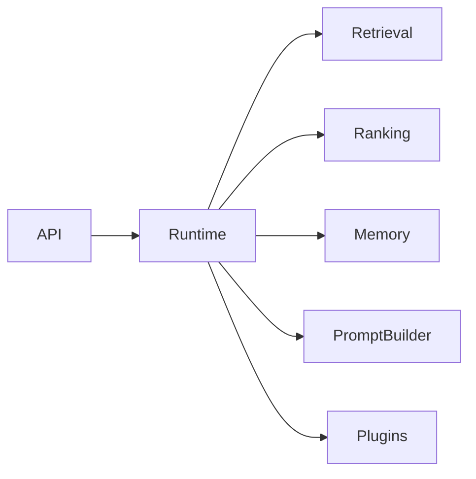

# Volume 3: Runtime

## Purpose

This volume defines the Context Runtime, the execution layer that coordinates retrieval, enrichment, ranking, memory, plugins, and prompt building.

## Goals

- Describe runtime responsibilities and non-responsibilities.
- Define control plane and data plane concepts.
- Prepare for runtime RFCs without implementation.

## Architecture

The runtime coordinates application services and plugin adapters while keeping domain rules independent from framework and vendor details.

## Diagrams

## Examples

A retrieval request enters the runtime, is planned, executed across providers, ranked, policy-filtered, and returned or assembled into a prompt package.

## Tradeoffs

A runtime can become a monolith if boundaries are weak. The architecture requires explicit ports and service boundaries from the beginning.

## Future Work

Runtime chapters will cover scheduling, plugin lifecycle, events, observability, caching, multitenancy, and failure handling.
