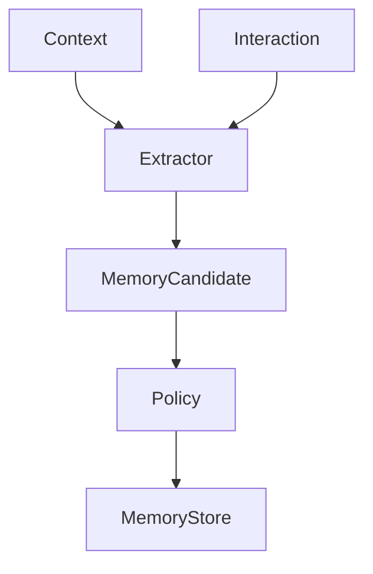

# Volume 4: Memory

## Purpose

This volume defines how durable and session memory are modeled, created, retrieved, updated, and expired.

## Goals

- Separate memory from raw context.
- Support scoped, revocable, explainable memory.
- Define safety and governance requirements.

## Architecture

Memory is derived from context events and explicit writes through policy-controlled services and stored behind provider ports.

## Diagrams

## Examples

Repository architecture summaries, user preferences, project conventions, and approved support runbooks are valid memory categories when scope and provenance are explicit.

## Tradeoffs

Memory improves continuity but increases privacy, retention, and correctness risk.

## Future Work

This volume will add memory taxonomies, retention models, consent flows, compaction, invalidation, and evaluation.
