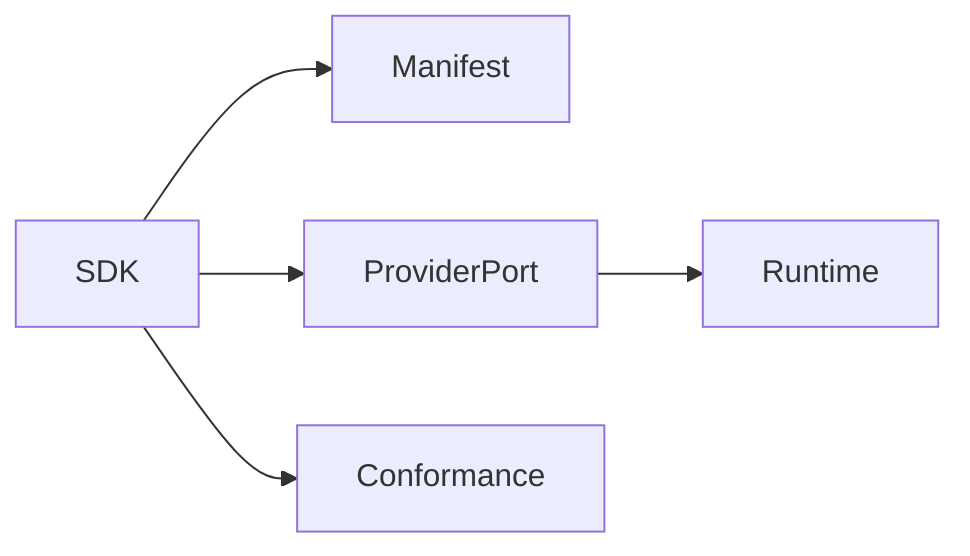

# Volume 5: Provider SDK

## Purpose

This volume defines how provider authors integrate external infrastructure with OpenContextPlatform.

## Goals

- Support LLM, embedding, graph, vector, storage, cache, authentication, and authorization providers.
- Define portable capabilities and extension metadata.
- Prepare SDKs for Python, TypeScript, Go, Java, Rust, and .NET.

## Architecture

Provider SDKs wrap runtime ports, manifest schemas, capability descriptors, health checks, and conformance fixtures.

## Diagrams

## Examples

A vector provider SDK implementation declares filter support, index operations, distance metrics, and batch limits.

## Tradeoffs

SDK consistency may constrain language idioms. The project will prefer portable semantics while allowing language-native ergonomics.

## Future Work

This volume will add language-specific SDK design, error contracts, streaming, testing, and compatibility matrices.
