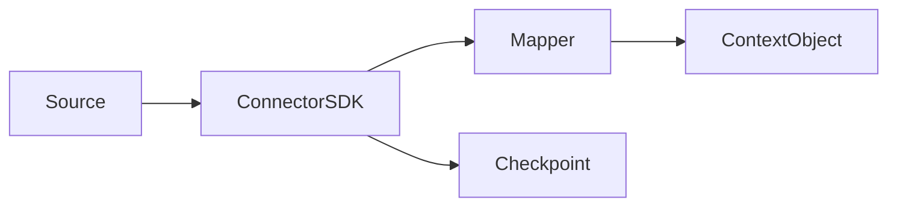

# Volume 6: Connector SDK

## Purpose

This volume defines how connector authors ingest external systems into OpenContextPlatform.

## Goals

- Support developer and enterprise sources.
- Preserve provenance, permissions, synchronization state, and deletion events.
- Provide conformance fixtures for connectors.

## Architecture

Connector SDKs expose source authentication, sync planners, record mapping, context emission, checkpointing, and webhook handling.

## Diagrams

## Examples

A Jira connector maps projects, issues, comments, labels, and permissions into context objects and change events.

## Tradeoffs

Generic connector abstractions can hide important source semantics. The SDK will preserve source-specific metadata while enforcing shared runtime contracts.

## Future Work

This volume will add sync modes, conflict handling, rate limits, retries, deletion semantics, and connector certification.
