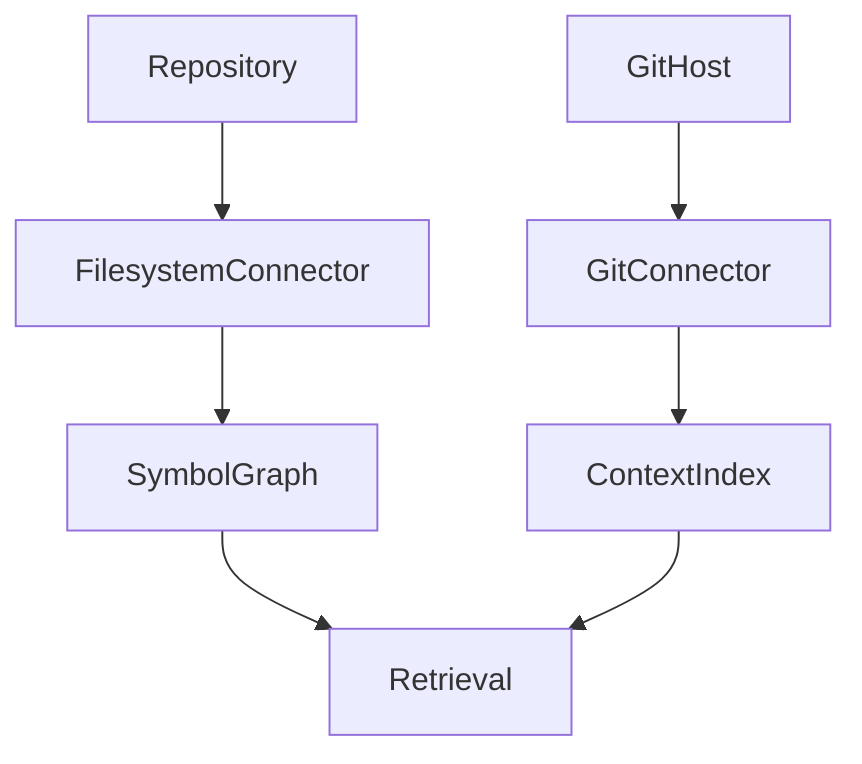

# Volume 7: Coding Context

## Purpose

This volume defines how OpenContextPlatform supports coding agents and developer tools.

## Goals

- Model repositories, symbols, dependencies, diffs, tests, issues, and reviews as context.
- Support local and remote development workflows.
- Provide ranking strategies for code tasks.

## Architecture

Coding context combines filesystem connectors, Git hosting connectors, symbol graph extraction, vector search, metadata search, and prompt building.

## Diagrams

## Examples

When editing a service handler, relevant context may include active file, imports, tests, API spec, recent pull request discussion, and related ADRs.

## Tradeoffs

Coding context must balance recall with token budgets and latency. Over-including context can degrade model quality.

## Future Work

This volume will add language server integration, symbol graph schema, workspace privacy, and coding-agent evaluation.
