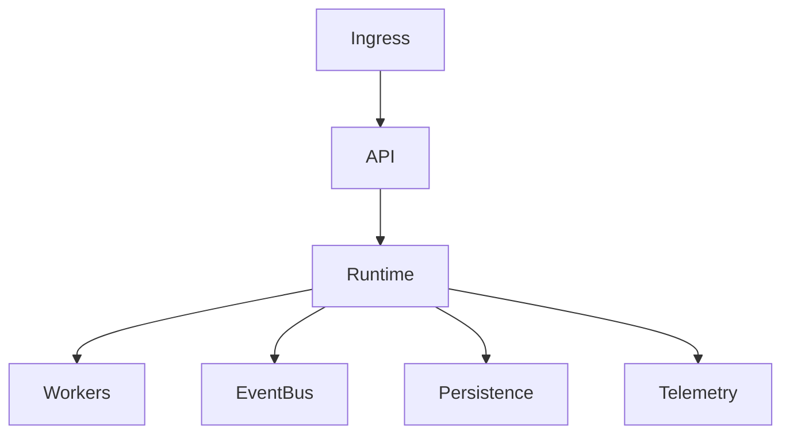

# Volume 8: Cloud

## Purpose

This volume defines OpenContext Cloud and cloud-native deployment architecture.

## Goals

- Support self-hosted and managed deployments.
- Define control plane, tenant isolation, scaling, and observability.
- Align Docker, Compose, Helm, Kubernetes, Terraform, AWS, Azure, and GCP.

## Architecture

Cloud architecture separates API ingress, runtime services, connector workers, provider adapters, event infrastructure, persistence, and telemetry.

## Diagrams

## Examples

A managed deployment may use Kubernetes, cloud IAM, managed databases, external vector storage, and tenant-scoped connector workers.

## Tradeoffs

Cloud portability increases abstraction cost. The project will document shared deployment primitives before generating provider-specific artifacts.

## Future Work

This volume will add topology, SLOs, autoscaling, backup, upgrades, tenancy, and disaster recovery.
