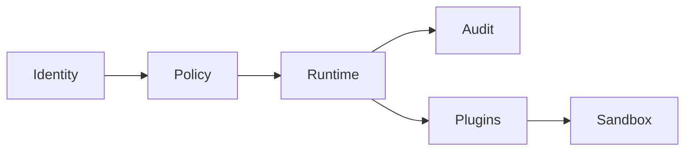

# Volume 9: Enterprise

## Purpose

This volume defines enterprise requirements for OpenContextPlatform.

## Goals

- Support authentication, authorization, audit, compliance, data residency, and policy controls.
- Preserve source permissions through retrieval and prompt building.
- Enable secure plugin and connector operations.

## Architecture

Enterprise architecture adds identity integration, policy enforcement, audit logging, tenant isolation, secrets management, and supply chain controls around the runtime.

## Diagrams

## Examples

An enterprise deployment can restrict Slack-derived context to authorized users and record prompt package citations for audit review.

## Tradeoffs

Enterprise controls can add latency and operational complexity. The platform must make those controls first-class rather than optional add-ons.

## Future Work

This volume will add RBAC, ABAC, audit schema, compliance mappings, data residency, and threat models.
