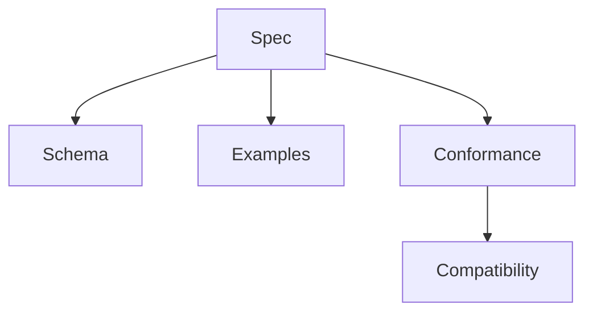

# Volume 10: Specifications

## Purpose

This volume explains the official OpenContextPlatform specifications and how they evolve.

## Goals

- Define normative contracts for context, memory, providers, connectors, plugins, ranking, retrieval, and prompt building.
- Establish compatibility and stability levels.
- Support conformance testing.

## Architecture

Specifications are versioned documents backed by schemas, examples, tests, and compatibility notes.

## Diagrams

## Examples

The Context Specification defines object semantics. The Provider Specification defines adapter contracts. The Plugin Specification defines lifecycle and packaging.

## Tradeoffs

Stable specifications require careful review and slower changes. That discipline is essential for ecosystem adoption.

## Future Work

This volume will add versioning rules, breaking-change policy, schema generation, and certification process.
