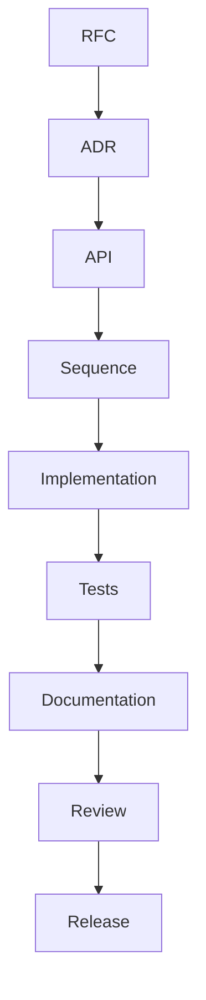

# Volume 11: Development

## Purpose

This volume defines how contributors build OpenContextPlatform.

## Goals

- Enforce the required lifecycle before implementation.
- Keep tests, docs, specs, and code synchronized.
- Define quality gates for runtime, SDKs, providers, connectors, and deployment.

## Architecture

Development work flows from RFCs and ADRs into design documents, then implementation, tests, documentation, review, and release.

## Diagrams

## Examples

A new provider adapter requires spec updates, provider RFC, ADR, conformance tests, integration tests, documentation, and release notes.

## Tradeoffs

The process is intentionally rigorous. The project is infrastructure, not a prototype.

## Future Work

This volume will add local development setup, branching policy, CI gates, coding standards, and release management.
