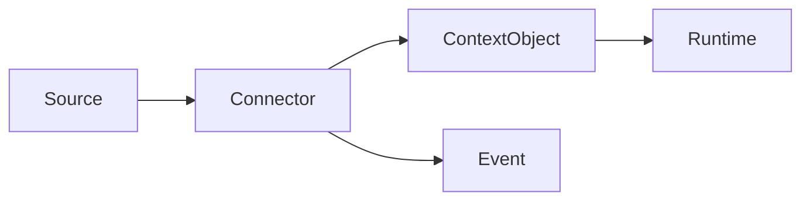

# Connectors

## Purpose

This directory will contain first-party connector plugins and connector conformance assets.

## Goals

- Ingest source systems as context objects and change events.
- Preserve source provenance and permissions.
- Support GitHub, GitLab, Bitbucket, Jira, Slack, Notion, Confluence, Filesystem, SQL, REST, and MCP.

## Architecture

Connectors are plugins that authenticate to sources, synchronize records, map records to context objects, and emit events.

## Diagrams

## Examples

A GitHub connector may map repositories, commits, files, pull requests, issues, reviews, and permissions.

## Tradeoffs

Connectors need source-specific behavior. The platform defines common lifecycle and output contracts without erasing source semantics.

## Future Work

Connector code waits for connector RFCs, sync design, security model, and conformance tests.
