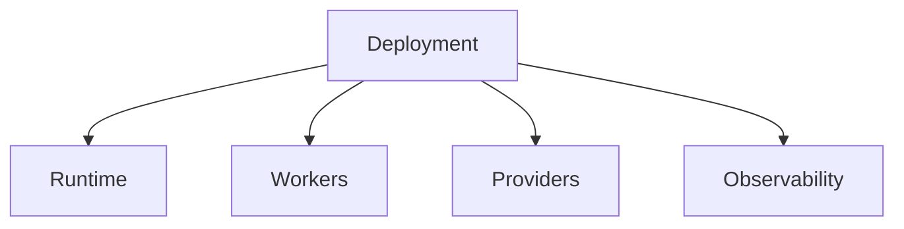

# Deployments

## Purpose

This directory will contain deployment assets for local, self-hosted, and cloud environments.

## Goals

- Support Docker, Compose, Helm, Kubernetes, Terraform, AWS, Azure, and GCP.
- Keep deployment artifacts secure by default.
- Align managed and self-hosted operational models.

## Architecture

Deployment assets will describe runtime services, connector workers, provider dependencies, event infrastructure, observability, secrets, scaling, and upgrades.

## Diagrams

## Examples

Compose may support local evaluation. Helm may support production Kubernetes. Terraform may provision cloud dependencies.

## Tradeoffs

Deployment breadth creates maintenance cost. Shared configuration contracts will reduce drift.

## Future Work

Deployment implementation waits for topology, security, and runtime configuration RFCs.
