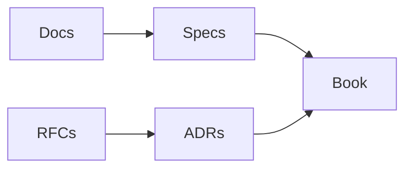

# Documentation

## Purpose

This directory contains operator, contributor, and architecture documentation for OpenContextPlatform.

## Goals

- Explain the platform in practical language.
- Link narrative docs to official specifications.
- Keep implementation work blocked until architecture and specs are accepted.

## Architecture

Documentation is layered: `docs/` explains concepts and operations, `specs/` defines normative contracts, `rfcs/` proposes changes, `adr/` records decisions, and `book/` provides the long-form architecture reference.

## Diagrams

## Examples

Start with `vision.md`, then read `architecture.md`, then the relevant topic document and specification.

## Tradeoffs

Duplication between docs and specs is minimized by keeping docs explanatory and specs normative.

## Future Work

Documentation will be published as a versioned site after the book structure stabilizes.
