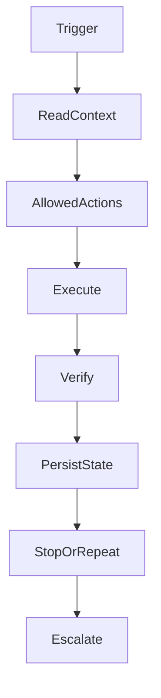

# Agentic Loop Method

## Purpose

This document adapts the referenced Claude loop workflow to OpenContextPlatform.

## Goals

- Define repeatable agentic execution without uncontrolled autonomy.
- Persist task, instructions, progress, and outputs.
- Require verification before a loop is considered complete.
- Escalate to humans when architectural or security boundaries are unclear.

## Architecture

The loop has six parts: trigger, context, allowed actions, verification, state, and stop rules. OpenContextPlatform adds lifecycle gates so loops cannot skip RFC, architecture, database design, API design, sequence diagrams, tests, documentation, review, or release.

## Diagrams

## Examples

A sprint loop may update roadmap and RFC documents, run Markdown quality checks, write progress, and stop when acceptance criteria pass. It must escalate before implementing runtime behavior.

## Tradeoffs

Loops increase throughput for repetitive planning and verification. Without strict permissions and stop rules, they can amplify mistakes. This project uses loops only inside explicit sprint scope.

## Future Work

Future loop automation may include scheduled runs, CI-backed verification, and connector-assisted issue or pull request synchronization.
