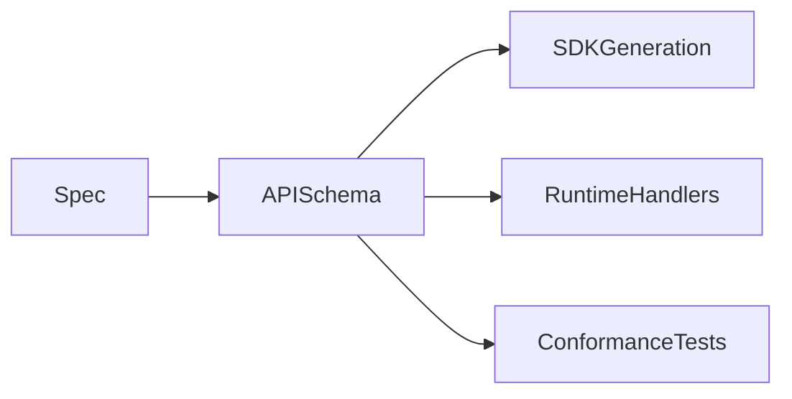

# API Design

## Purpose

This document defines API design principles for OpenContextPlatform.

## Goals

- Keep APIs specification-first and stable.
- Support REST, SDKs, future streaming interfaces, and plugin contracts.
- Make errors, pagination, idempotency, authentication, and authorization consistent.

## Architecture

API design will derive from specifications and use OpenAPI or equivalent schemas before implementation.

## Diagrams

## Examples

A context retrieval endpoint must reference the Retrieval Specification, return context objects defined by the Context Specification, and expose ranking explanations from the Ranking Specification.

## Tradeoffs

API-first development adds schema design work but enables SDK generation, compatibility review, and conformance testing.

## Future Work

Future API design will define versioning, OpenAPI files, streaming contracts, error taxonomy, and authentication flows.
