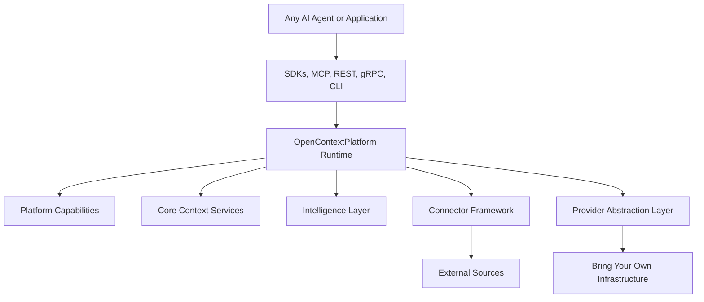
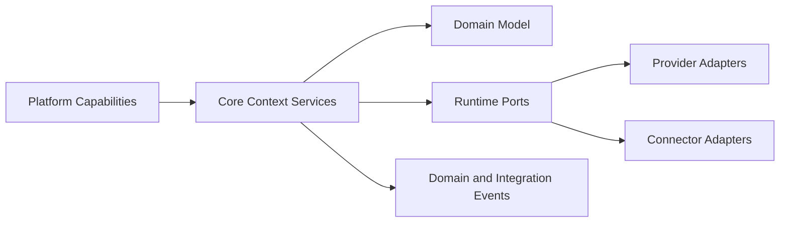

# Architecture

## Purpose

This document summarizes the architectural style for OpenContextPlatform.

## Goals

- Protect the domain core from framework and vendor coupling.
- Make all infrastructure replaceable through ports and adapters.
- Support enterprise-scale operations, security, and observability.

## Architecture

The platform combines Clean Architecture, DDD, Hexagonal Architecture, selective CQRS, Plugin Architecture, Event Driven design, and Cloud Native deployment.

The high-level product architecture is organized into eight layers:

- Any AI agent or application.
- Interface layer.
- Platform capabilities.
- Core context services.
- Intelligence layer.
- Connector framework.
- Provider abstraction layer.
- Bring-your-own infrastructure.

## Diagrams

## Examples

Retrieval orchestration belongs in core context services. Ranking rules belong behind ranking ports. Vector database calls belong in provider adapters. GitHub, Jira, Slack, Notion, filesystem, SQL, REST, and MCP ingestion belongs in connector adapters. Context identity, provenance, and policy belong in the domain.

## Tradeoffs

The architecture introduces more boundaries than a simple service. Those boundaries are necessary because providers, connectors, deployment modes, and SDKs must evolve independently.

## Future Work

Architecture diagrams will be expanded into runtime, control plane, data plane, plugin lifecycle, and deployment views.
