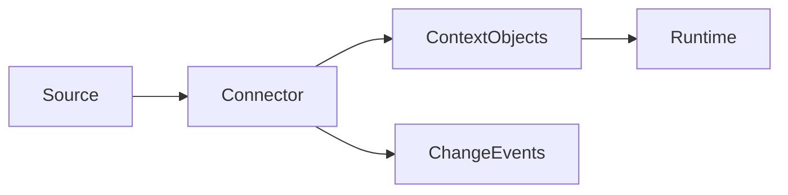

# Connector Architecture

## Purpose

This document explains how source systems become context through connectors.

## Goals

- Support common developer and enterprise systems.
- Preserve source permissions and provenance.
- Enable incremental synchronization and deletion propagation.

## Architecture

Connectors are plugins that authenticate to external systems, map source records into context objects, and emit change events to the runtime.

## Diagrams

## Examples

Initial connector families include GitHub, GitLab, Bitbucket, Jira, Slack, Notion, Confluence, Filesystem, SQL, REST, and MCP.

## Tradeoffs

Each source has unique semantics. The connector model preserves source metadata while enforcing a shared ingestion contract.

## Future Work

Connector SDKs will define sync checkpoints, webhook behavior, rate limit handling, and test fixtures.
