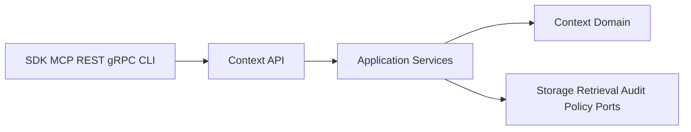

# Context API Design

## Purpose

This document designs the future context API surface before OpenAPI files or runtime handlers are created.

## Goals

- Define the minimum context API capabilities implied by the accepted context contract.
- Align REST, SDK, MCP, gRPC, and CLI surfaces around the same semantics.
- Keep API behavior specification-first and conformance-testable.

## Architecture

Context APIs will expose commands and queries over context objects. Commands mutate context state through application services. Queries read context through policy-aware application services. Runtime handlers must not bypass domain, policy, or audit rules.

## Diagrams

## Examples

A connector ingestion API may submit a batch of context objects. A retrieval API may return policy-filtered context objects with ranking explanations and provenance. A lifecycle API may mark a source object as deleted or redacted.

### Proposed API Capabilities

| Capability | Intent | Notes |
| --- | --- | --- |
| ingest context | accept connector-produced context objects or batches | idempotency required |
| get context | fetch by context id inside tenant boundary | authorization required |
| query context | filter by type, source, metadata, lifecycle, and policy-visible scope | cursor pagination required |
| update lifecycle | mark stale, superseded, deleted, redacted, or archived | audit required |
| link context | create relationship edges between context objects | relationship validation required |
| retrieve context | run retrieval pipeline and return candidates with explanations | ranking may be separate |

### API Rules

- Public APIs must use versioned contracts.
- Mutations must be idempotent where retries are expected.
- Queries must be authorization-aware by default.
- Error responses must include stable error code, retryability, correlation id, and policy denial details where safe.
- Context APIs must preserve provenance and policy fields end to end.

## Tradeoffs

Designing capability-level APIs before OpenAPI files leaves some wire details unresolved. The benefit is that API design stays aligned with architecture and avoids premature transport-specific choices.

## Future Work

Create OpenAPI design, define error taxonomy, decide version path or header strategy, define SDK generation tooling, and connect API contracts to conformance tests.
