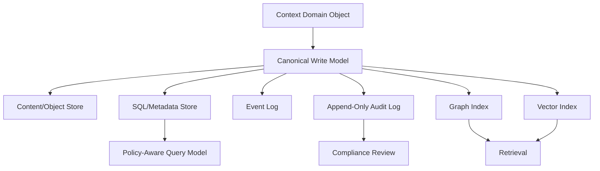

# Context Database Design

## Purpose

This document designs how context object semantics map to persistence without choosing or implementing a specific database.

## Goals

- Preserve provider neutrality across relational, graph, vector, object, cache, and event stores.
- Define write model, read model, and index responsibilities.
- Keep persistence aligned with policy, provenance, lifecycle, and conformance requirements.

## Architecture

Context persistence uses a logical write model for canonical context state and specialized read models for retrieval, graph traversal, metadata filtering, audit, and prompt citation. Physical storage is supplied through provider adapters.

## Diagrams

## Examples

Inline text can be stored in a metadata store for small context objects, while large content or multimodal payloads can be stored in object storage and referenced by the canonical context record. Relationships can be projected into a graph index, and embeddings can be projected into vector indexes.

### Logical Persistence Responsibilities

| Model | Responsibility | Provider Category |
| --- | --- | --- |
| canonical write model | identity, type, metadata, provenance, policy, lifecycle, timestamps | SQL/metadata or document storage |
| content payload store | large text, files, multimodal payloads, compressed content | object/file storage |
| event log | ingestion, update, lifecycle, deletion, policy, ranking, prompt events | queue/stream/event store |
| audit log | append-only security and compliance records for ingestion, retrieval, lifecycle, policy, prompt, and admin decisions | SQL/metadata, event store, or dedicated audit storage |
| graph projection | relationships, dependencies, lineage, entity graph | graph database |
| vector projection | embeddings and semantic search indexes | vector database |
| cache projection | hot retrieval, policy decisions, query plans | cache provider |

### Design Decisions

- The canonical write model must preserve policy and provenance even if projections drop fields for performance.
- Lifecycle changes must emit events so projections can update or delete derived data.
- Security-relevant decisions must be written to an append-only audit model that is separate from mutable context state.
- Retrieval indexes are projections, not sources of truth.
- Tenant boundaries must be present in every persistence and projection model.
- Audit records must reference context identity, actor identity, tenant boundary, decision type, timestamp, and correlation id without storing secrets or unnecessary content payloads.

## Tradeoffs

Multiple logical models increase operational complexity, but a single database shape cannot serve canonical state, graph traversal, vector retrieval, audit, and high-throughput query needs equally well.

## Future Work

Define provider-neutral migration strategy, consistency model, projection rebuild process, backup and retention requirements, and concrete schemas after provider decisions are accepted.
