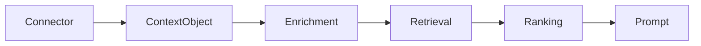

# Context Object

## Purpose

This document explains the context object described normatively in the Context Specification.

## Goals

- Make context understandable to application developers.
- Show how content, provenance, policy, and relationships travel together.
- Avoid treating context as anonymous text chunks.

## Architecture

Context objects are created by connectors, enriched by runtime services, indexed by providers, ranked by ranking pipelines, and rendered by prompt builders.

## Diagrams

## Examples

A source file chunk includes repository path, commit, language, symbol metadata, access policy, relationships to imports, and content payload.

## Tradeoffs

Rich context objects cost more to ingest and store. The benefit is safer retrieval, better ranking, and explainable prompts.

## Future Work

Future docs will include JSON examples once schemas are approved in the specification.
