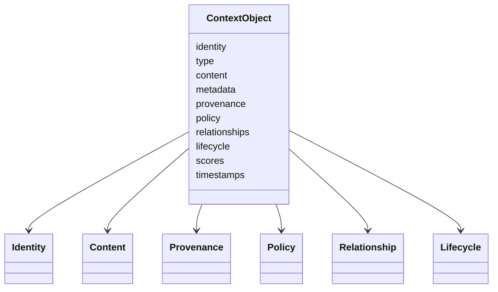

# Context Schema Design

## Purpose

This document designs the future machine-readable schema for OpenContextPlatform context objects without creating the schema file yet.

## Goals

- Translate RFC-002 and ADR-0011 into schema-ready field groups.
- Define required semantic areas before JSON Schema or OpenAPI files are written.
- Identify compatibility-sensitive fields.
- Support conformance, API generation, storage mapping, retrieval, ranking, memory, and prompt citation.

## Architecture

The context schema will describe a domain object, not a storage record. Implementations may split, index, compress, or externalize fields, but API and conformance behavior must preserve the schema semantics.

## Diagrams

## Examples

A GitHub file chunk should carry identity, tenant boundary, source path, commit provenance, content media type, source ACL references, symbol relationships, lifecycle state, and retrieval or ranking score explanations.

### Proposed Field Groups

| Field Group | Intent | Compatibility Sensitivity |
| --- | --- | --- |
| identity | stable id, tenant id, source id, parent id, canonical hash | High |
| type | context category and optional subtype | High |
| content | inline content or content reference, media type, language, encoding, size | High |
| metadata | structured filterable attributes and extension namespace | Medium |
| provenance | source system, connector, actor, source version, transformation lineage | High |
| policy | access control, tenancy, retention, redaction, allowed use, audit requirements | High |
| relationships | typed links to other context objects or external source objects | Medium |
| lifecycle | created, active, stale, superseded, deleted, redacted, archived, derived | High |
| scores | retrieval, ranking, confidence, freshness, authority, explanation data | Medium |
| timestamps | created, updated, observed, indexed, expired | Medium |

### Design Decisions

- `identity`, `provenance`, `policy`, and `lifecycle` must be treated as compatibility-critical.
- Provider-specific extensions must live under explicit extension namespaces.
- Content may be inline or referenced because large files and multimodal payloads should not be forced into one storage shape.
- Policy must be part of the schema contract, not a side channel.

## Tradeoffs

A schema-ready design with rich policy and provenance is heavier than a minimal document chunk. The additional structure is necessary for enterprise-safe retrieval, source permission preservation, audit, and prompt citation.

## Future Work

Create the JSON Schema, define canonical hashing, define lifecycle transition validation, define policy schema, and add context conformance fixtures after design review.
