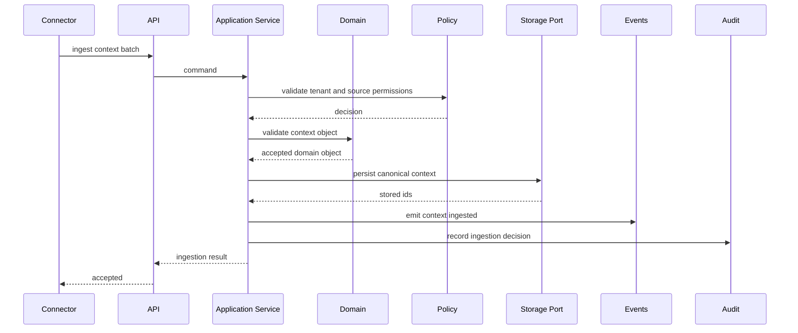
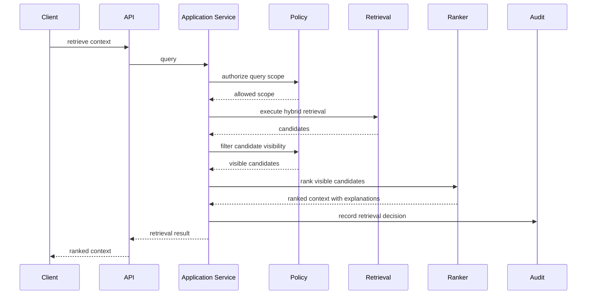
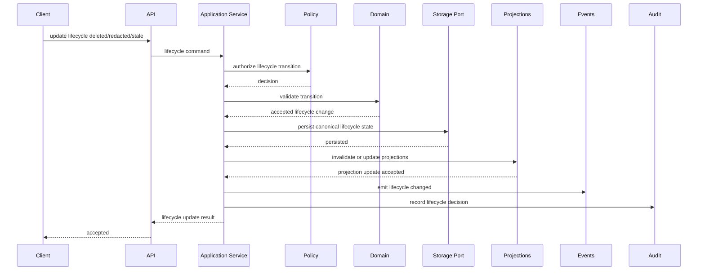

# Context Sequence Design

## Purpose

This document defines the first context object sequence diagrams required before runtime scaffolding.

## Goals

- Make context ingestion, retrieval, lifecycle update, and permission filtering flows reviewable.
- Show boundaries between clients, APIs, application services, domain, ports, providers, connectors, audit, and events.
- Identify security and failure-mode checkpoints before implementation.

## Architecture

Sequence design follows the accepted runtime architecture. Interfaces call application services. Application services enforce policy and domain rules through ports. Providers and connectors operate behind adapters. Audit and event emission are part of successful state changes and security-relevant decisions.

## Diagrams

## Examples

Lifecycle deletion should validate source authority, update canonical state, emit lifecycle events, invalidate projections, and write audit records. Retrieval should apply authorization before ranking and before prompt building.

### Required Flow Checkpoints

| Flow | Required Checkpoints |
| --- | --- |
| ingestion | idempotency, tenant validation, source permission mapping, domain validation, persistence, event, audit |
| retrieval | query authorization, hybrid retrieval, candidate policy filtering, ranking, explanations, audit |
| lifecycle update | actor authorization, lifecycle transition validation, projection invalidation, event, audit |
| relationship link | source authority, relationship type validation, cycle or duplicate rules, event, audit |

## Tradeoffs

Sequence diagrams can become stale, but they reveal missing boundaries and security checks before code exists. The project accepts that maintenance cost because context infrastructure crosses many trust boundaries.

## Future Work

Add sequence diagrams for prompt assembly, memory derivation, plugin loading, connector sync, projection rebuilds, relationship linking, and policy denial flows.
