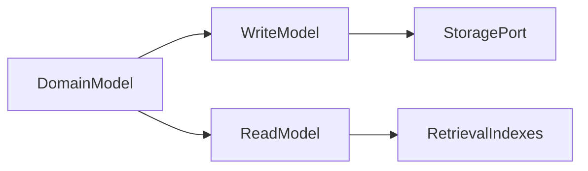

# Database Design

## Purpose

This document defines how database design will be approached before persistence implementation exists.

## Goals

- Keep domain concepts independent from any single database.
- Support graph, vector, relational, object, cache, and event storage providers.
- Document persistence tradeoffs before schema creation.

## Architecture

Database design will start from domain aggregates and query models, then map them to provider ports and storage-specific adapters. CQRS may be used where read and write models need different storage shapes.

## Diagrams

## Examples

Context provenance may be modeled as domain metadata while graph relationships and vector embeddings are stored in specialized provider-backed indexes.

## Tradeoffs

Provider-agnostic persistence requires careful abstraction. Over-abstraction can hide important storage capabilities, while under-abstraction creates lock-in.

## Future Work

Future database design docs will define aggregates, indexes, migrations, tenancy, retention, backup, and consistency models.
