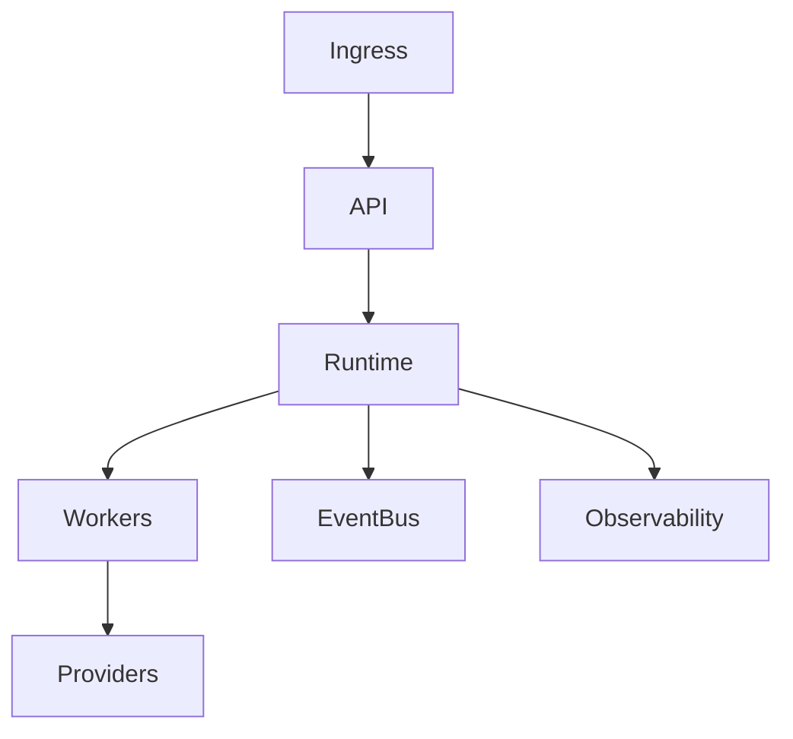

# Deployment

## Purpose

This document defines the deployment targets OpenContextPlatform will support.

## Goals

- Support Docker, Compose, Helm, Kubernetes, Terraform, AWS, Azure, and GCP.
- Keep self-hosted and managed cloud deployment models aligned.
- Provide secure defaults for enterprise environments.

## Architecture

Deployments will separate control plane, runtime services, provider adapters, connector workers, event infrastructure, and observability.

## Diagrams

## Examples

Local development may use Compose. Production may use Helm on Kubernetes with managed vector, graph, storage, cache, and identity providers.

## Tradeoffs

Supporting many deployment targets increases maintenance cost. The project will define shared primitives and generate environment-specific artifacts where possible.

## Future Work

Deployment specs will define topology, scaling, health checks, secrets, backup, disaster recovery, and upgrade paths.
