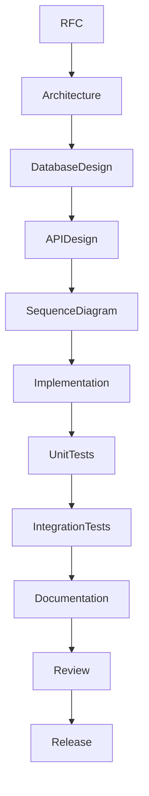

# Development Lifecycle

## Purpose

This document defines the required lifecycle for all OpenContextPlatform work.

## Goals

- Prevent implementation before design.
- Keep documentation, tests, and code synchronized.
- Make release readiness explicit.

## Architecture

Every meaningful change follows this sequence: RFC, Architecture, Database Design, API Design, Sequence Diagram, Implementation, Unit Tests, Integration Tests, Documentation, Review, and Release.

## Diagrams

## Examples

A retrieval feature must first update retrieval RFCs and specs, then document storage impact, API shape, sequence diagrams, tests, docs, and release notes.

## Tradeoffs

This lifecycle is stricter than most early-stage repositories. The discipline is necessary because the project aims to become infrastructure other teams depend on.

## Future Work

CI will enforce lifecycle artifacts through pull request templates and required checks.
