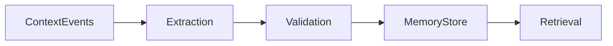

# Memory Model

## Purpose

This document explains how OpenContextPlatform distinguishes raw context from derived memory.

## Goals

- Support long-lived agent and enterprise memory safely.
- Make memory scoped, explainable, and revocable.
- Avoid silent accumulation of stale or unauthorized facts.

## Architecture

Memory is produced by extractors and summarizers from context events, then stored through memory providers with policy, provenance, decay, and invalidation metadata.

## Diagrams

## Examples

Project memory may summarize service boundaries. User memory may store stated preferences. Enterprise memory may capture approved support procedures.

## Tradeoffs

Automatic memory improves continuity but raises privacy and correctness risk. Explicit scopes and provenance are mandatory.

## Future Work

Memory consent, retention, compaction, and conflict resolution will be specified before implementation.
