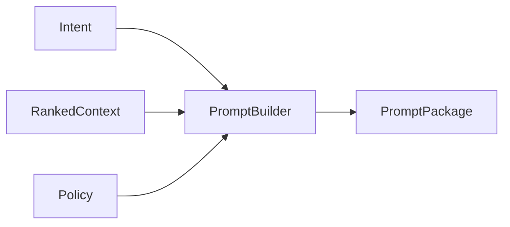

# Prompt Builder

## Purpose

This document explains how OpenContextPlatform assembles model-ready prompts from ranked context and policies.

## Goals

- Build deterministic, auditable prompt packages.
- Respect token budgets and model capabilities.
- Preserve citations and redaction records.

## Architecture

Prompt building consumes task intent, ranked context, memory, policy, and provider constraints, then emits a structured package for a target LLM.

## Diagrams

## Examples

A coding prompt can include active file excerpts, dependency context, relevant tests, architecture constraints, and citations to source objects.

## Tradeoffs

Provider-specific prompt rendering improves quality, but the core prompt package must remain portable.

## Future Work

Token accounting, template rules, redaction schema, and evaluation fixtures will be specified before implementation.
