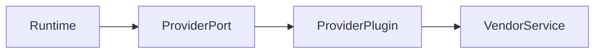

# Provider Architecture

## Purpose

This document explains provider extensibility for operators and plugin authors.

## Goals

- Make LLM, embedding, graph, vector, storage, cache, authentication, and authorization providers pluggable.
- Keep vendor capabilities discoverable.
- Enable conformance testing.

## Architecture

Providers implement runtime ports and declare capabilities through plugin manifests. The runtime depends on contracts, not vendor SDKs.

## Diagrams

## Examples

An operator may run OpenContextPlatform with PostgreSQL storage, Qdrant vectors, Neo4j graph, Redis cache, and a self-hosted embedding model.

## Tradeoffs

Common contracts reduce lock-in but may hide advanced vendor features. Extension metadata allows advanced use without breaking portability.

## Future Work

Provider certification and compatibility matrices will be added after conformance suites exist.
