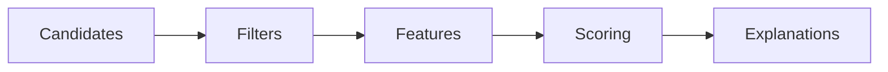

# Ranking

## Purpose

This document explains how retrieved context is ordered before use.

## Goals

- Rank context using intent, relevance, recency, authority, relationships, and policy.
- Make ranking explainable.
- Support pluggable rankers and rerankers.

## Architecture

Ranking is a pipeline after retrieval and before prompt building. It filters unsafe candidates, computes features, scores results, and emits explanations.

## Diagrams

## Examples

An active source file, its direct dependencies, and the relevant ADR may outrank generic documentation for a coding task.

## Tradeoffs

Explainable ranking may be less opaque than pure model-based reranking, but enterprise users need auditability.

## Future Work

Ranking evaluation datasets and feedback learning contracts will be developed through RFCs.
