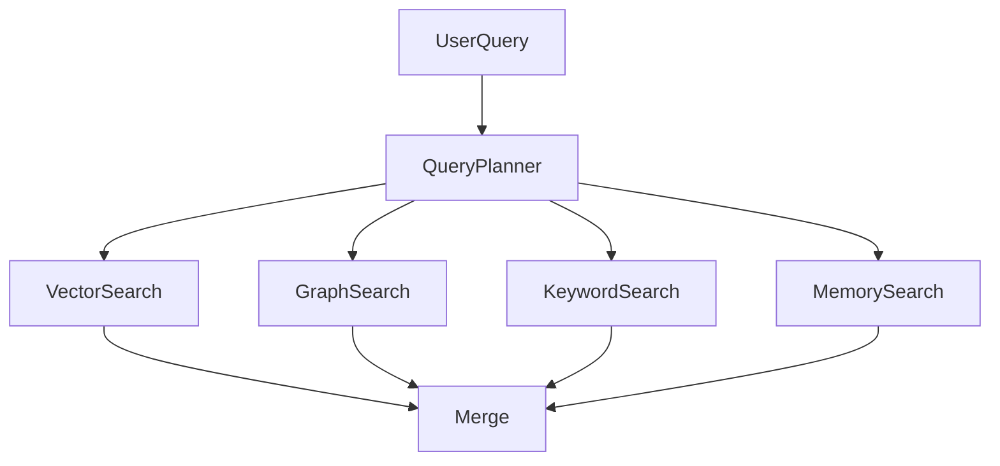

# Retrieval

## Purpose

This document explains how OpenContextPlatform finds candidate context.

## Goals

- Combine vector, graph, keyword, metadata, memory, and connector-backed retrieval.
- Preserve tenant isolation and authorization.
- Provide explainable retrieval results.

## Architecture

Retrieval uses query planning and fan-out across provider-backed indexes, followed by merge and ranking stages.

## Diagrams

## Examples

For coding assistance, retrieval may combine symbol graph neighbors, similar code chunks, active branch diffs, and recent issue discussions.

## Tradeoffs

Hybrid retrieval improves recall but requires latency budgets, caching, and careful query planning.

## Future Work

Retrieval DSL, pagination, streaming, and benchmarks will be specified before runtime code is written.
