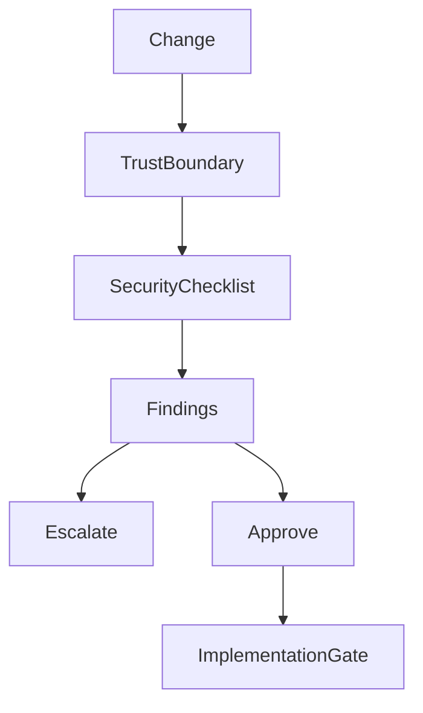

# Security Review Checklist

## Purpose

This checklist defines the security review expectations for OpenContextPlatform specifications, RFCs, ADRs, runtime design, providers, connectors, SDKs, deployments, and documentation.

## Goals

- Make authentication, authorization, connector permissions, plugin isolation, prompt safety, secrets, audit, tenancy, supply chain, and disclosure review explicit.
- Identify decisions that must be escalated before implementation.
- Keep enterprise security requirements visible before runtime code exists.

## Architecture

Security review is a lifecycle gate that starts during RFC and specification work. It must happen before implementation when a change touches trust boundaries, identity, authorization, data movement, plugins, connectors, memory, prompt building, storage, deployment, or supply chain.

## Diagrams

## Examples

A connector design must show how source permissions are captured, stored, propagated through retrieval, respected during ranking, and preserved during prompt building. A plugin design must show how untrusted third-party code is discovered, validated, configured, isolated, monitored, and disabled.

### Required Security Checks

| Area | Review Questions | Escalate Before Implementation When |
| --- | --- | --- |
| Authentication | How are users, services, connectors, providers, and plugins authenticated? | Identity source or credential exchange is undefined |
| Authorization | How are user, tenant, project, source, and object permissions enforced? | Any retrieved context can bypass source permissions |
| Connector Permissions | How are source ACLs, workspace roles, deletion events, and sharing changes mapped? | Permissions cannot be represented in context objects |
| Plugin Isolation | How are plugins loaded, sandboxed, signed, configured, disabled, and upgraded? | Third-party plugin trust model is unclear |
| Prompt Safety | How are prompt injection, unauthorized context inclusion, redaction, citations, and instruction boundaries handled? | Prompt builder can mix untrusted content with privileged instructions |
| Secrets | Where are tokens, API keys, webhooks, signing keys, and provider credentials stored? | Secrets appear in logs, context objects, prompts, docs, examples, or tests |
| Audit | What actions, retrieval decisions, prompt packages, plugin events, and connector syncs are auditable? | Enterprise-relevant decisions leave no audit trail |
| Tenancy | How are tenant, organization, project, user, and workspace boundaries enforced? | Data isolation depends only on caller convention |
| Supply Chain | How are dependencies, plugins, images, artifacts, SBOMs, signatures, and provenance handled? | Build or plugin artifacts cannot be traced or verified |
| Data Retention | How are memory retention, deletion, legal hold, source removal, and derived data handled? | Derived memory can outlive source policy without review |
| Observability | Do logs, metrics, traces, and errors avoid sensitive data exposure? | Operational signals may leak secrets or private content |
| Disclosure | How are vulnerabilities reported, triaged, fixed, and communicated? | A release affects security posture without advisory planning |

### Severity Levels

| Severity | Meaning | Required Action |
| --- | --- | --- |
| Critical | Direct data exposure, auth bypass, credential leak, plugin escape, or cross-tenant access | Stop work and escalate |
| High | Likely security failure under normal enterprise use | Block implementation until resolved |
| Medium | Security ambiguity or missing mitigation that can be resolved in design | Track in RFC or ADR before implementation |
| Low | Documentation or operational hardening issue | Resolve before release |

### Required Review Artifacts

Security-sensitive RFCs and ADRs must include:

- Trust boundaries.
- Threat model summary.
- Permission propagation model.
- Secrets handling model.
- Audit and observability expectations.
- Known residual risk.
- Escalation owner.

## Tradeoffs

Security review adds friction to early design, but context infrastructure routinely touches private source systems, enterprise knowledge, user memory, and model prompts. Treating security as a late-stage concern would create unacceptable architectural risk.

## Future Work

Future work should add threat model templates, security test fixtures, dependency and SBOM policy, plugin signing policy, vulnerability disclosure SLAs, and CI security gates.
