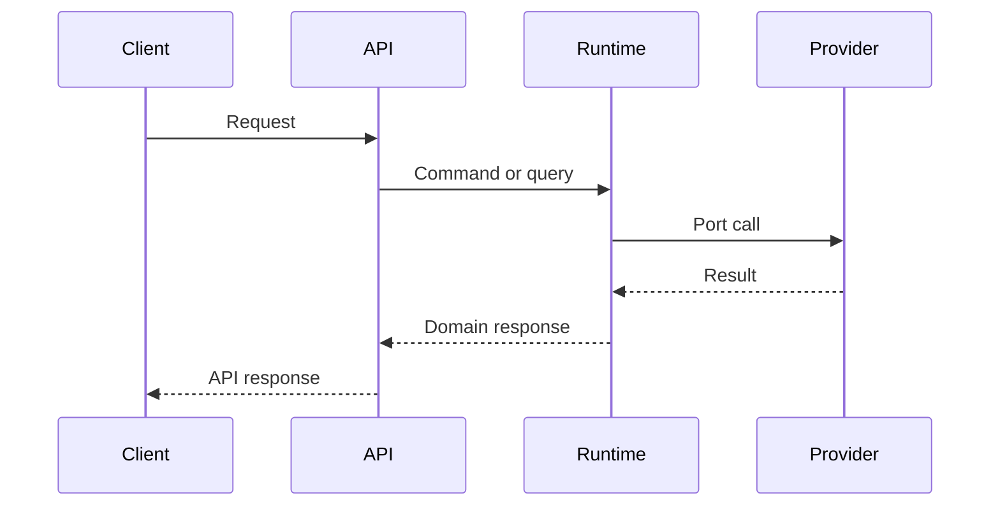

# Sequence Diagrams

## Purpose

This document defines how sequence diagrams are used in OpenContextPlatform design.

## Goals

- Make runtime flows reviewable before implementation.
- Capture boundaries between APIs, application services, domain, providers, connectors, and events.
- Support security and failure-mode review.

## Architecture

Sequence diagrams are required for changes that cross process, plugin, provider, connector, storage, or security boundaries.

## Diagrams

## Examples

Retrieval, connector sync, provider loading, prompt building, memory writes, and authorization checks all require sequence diagrams.

## Tradeoffs

Sequence diagrams can become stale unless reviewed with code. They are mandatory for boundary-crossing flows because they reveal coupling early.

## Future Work

Future diagrams will be added to RFCs and promoted into the architecture book after acceptance.
