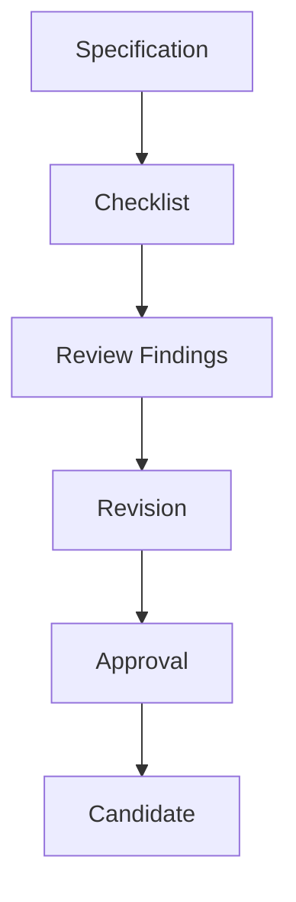

# Specification Review Checklist

## Purpose

This checklist defines how OpenContextPlatform specifications are reviewed before promotion beyond Draft.

## Goals

- Make specification review consistent across agents and maintainers.
- Ensure specifications are normative, testable, secure, and compatible.
- Prevent implementation from starting from incomplete contracts.

## Architecture

Specification review is a lifecycle gate between RFC/ADR work and implementation planning. A specification cannot become Candidate or Stable until it satisfies this checklist and has an associated conformance strategy.

## Diagrams

## Examples

A provider specification passes review only when it defines capabilities, errors, lifecycle expectations, health checks, security requirements, examples, conformance expectations, and compatibility boundaries.

### Required Review Checks

| Area | Questions | Required Outcome |
| --- | --- | --- |
| Purpose and Scope | Does the specification define what is included and excluded? | Clear scope and non-goals |
| Normative Language | Are required, optional, and prohibited behaviors explicit? | Consistent use of MUST, SHOULD, MAY, and MUST NOT after stability policy is accepted |
| Architecture | Does it map to domain, application, port, adapter, plugin, or deployment boundaries? | Boundary ownership is clear |
| API and Schema Readiness | Are public shapes, identifiers, lifecycle states, errors, and versioning needs identified? | Schema work can begin without guessing |
| Compatibility | Does it define breaking-change risk and migration impact? | Compatibility notes exist |
| Security | Are authentication, authorization, tenancy, secrets, trust boundaries, and audit concerns addressed? | Security review can proceed |
| Observability | Are events, health, logs, metrics, traces, or explanations needed? | Operational signals are identified |
| Conformance | Can the contract be tested across implementations? | Future conformance cases are listed |
| Examples | Are examples concrete and representative? | At least one realistic example exists |
| Diagrams | Are relationships or flows diagrammed where useful? | Mermaid diagrams are present and reviewable |
| Tradeoffs | Are rejected alternatives or known costs explicit? | Tradeoffs are visible |
| Future Work | Are deferred decisions clearly bounded? | Deferred items do not hide implementation blockers |

### Promotion Rules

| Target Level | Required Evidence |
| --- | --- |
| Review Ready | Checklist complete, open questions listed, RFC draft available |
| Candidate | RFC accepted, ADR recorded, schema plan defined, conformance strategy defined |
| Stable | Versioned schema, compatibility policy, conformance tests, implementation evidence |

### Review Findings Format

Each review finding should include:

- Specification name.
- Checklist area.
- Severity: Blocker, Major, Minor, or Editorial.
- Required change.
- Linked RFC, ADR, or issue when available.

## Tradeoffs

This checklist may slow early specification writing, but it gives reviewers a shared standard and keeps implementation decisions out of ambiguous prose.

## Future Work

Future work should turn this checklist into pull request templates, CI validation, and release-gate automation.
