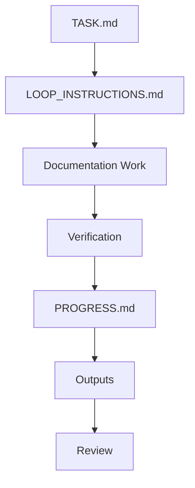

# Sprint 001: Foundation Specifications

## Purpose

Sprint 001 turns the bootstrap documentation into a specification-ready foundation for OpenContextPlatform.

## Goals

- Harden the roadmap and sprint plan.
- Define loop execution artifacts for controlled iteration.
- Build the backlog for RFCs, ADRs, and specification maturity.
- Keep the repository documentation-only during this sprint.

## Architecture

Sprint 001 uses an agentic loop adapted for OpenContextPlatform. The loop stores task definition, instructions, progress, verification, and outputs under `.ai/loops/sprint-001-foundation-specs/`.

## Diagrams

## Examples

The first loop iteration updates the roadmap, creates this sprint plan, defines stop and escalation rules, and produces a reviewable sprint output summary.

### Implementation Task Plan

Sprint 001 implementation means implementing documentation and specification artifacts, not runtime business logic.

| ID | Task | Owner Role | Depends On | Acceptance Criteria |
| --- | --- | --- | --- | --- |
| S1-001 | Create specification maturity matrix | Architect | Bootstrap specs | Matrix covers context, memory, providers, connectors, plugins, retrieval, ranking, and prompt builder with status, gaps, risks, and next RFC |
| S1-002 | Draft RFC backlog | Planner | S1-001 | Backlog includes runtime architecture, plugin lifecycle, provider SDK, connector SDK, API versioning, conformance, deployment topology, and security model |
| S1-003 | Draft ADR backlog | Architect | S1-001 | ADR candidates include specification stability, API-first contracts, plugin model, monorepo governance, test strategy, and security posture |
| S1-004 | Expand specification review checklist | Reviewer | S1-001 | Checklist validates purpose, scope, normative language, compatibility, examples, diagrams, tradeoffs, and future work |
| S1-005 | Define conformance test strategy | Tester | S1-001, S1-002 | Strategy covers provider, connector, context object, retrieval, ranking, prompt builder, and memory conformance without writing test code |
| S1-006 | Define security review checklist | Security | S1-002, S1-003 | Checklist covers authn, authz, plugin isolation, connector permissions, prompt safety, secrets, audit, and supply chain |
| S1-007 | Produce Sprint 001 review package | Documentation | S1-001 through S1-006 | Output summarizes deliverables, risks, open decisions, verification results, and recommended Sprint 002 scope |
| S1-008 | Verify documentation compliance | Reviewer | S1-007 | All Markdown files include required sections and no business logic implementation exists |

## Tradeoffs

The sprint avoids implementation even though runtime scaffolding would be tempting. Specification maturity is the higher-leverage milestone.

## Future Work

Future iterations of this sprint should expand RFCs for runtime architecture, plugin lifecycle, provider SDK, connector SDK, API versioning, and conformance.
