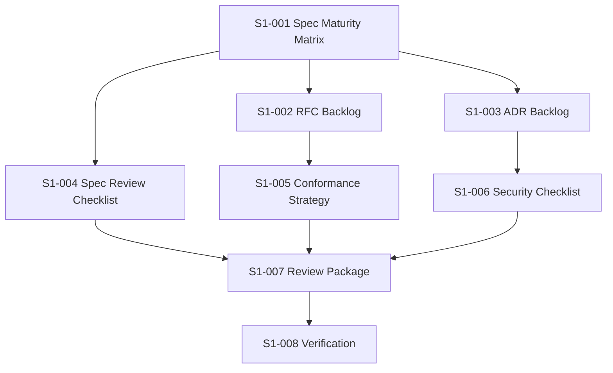

# Sprint 001 Implementation Tasks

## Purpose

This document turns Sprint 001 into an implementation-ready task plan. In this sprint, implementation means producing planning, specification, RFC, ADR, review, and verification artifacts only.

## Goals

- Make each Sprint 001 task independently reviewable.
- Define dependencies, owners, outputs, and acceptance criteria.
- Preserve the rule that no runtime business logic is implemented during Sprint 001.
- Prepare the project for Sprint 002 runtime architecture work.

## Architecture

Sprint 001 tasks follow the same lifecycle as product work, stopping before code implementation. The task chain is: specification maturity, RFC backlog, ADR backlog, review checklists, conformance strategy, security strategy, review package, and verification.

## Diagrams

## Examples

### S1-001: Specification Maturity Matrix

Output: `docs/sprints/sprint-001-specification-maturity.md`

Acceptance criteria:

- Covers all eight official specifications.
- Assigns maturity levels: Draft, Review Ready, Candidate, Stable, or Deferred.
- Lists gaps, risks, dependencies, and recommended next RFC for each specification.

### S1-002: RFC Backlog

Output: `rfcs/backlog.md`

Acceptance criteria:

- Defines RFC candidates for runtime architecture, plugin lifecycle, provider SDK, connector SDK, API versioning, conformance, deployment topology, and security model.
- Includes priority, rationale, owner role, dependencies, and proposed sprint.

### S1-003: ADR Backlog

Output: `adr/backlog.md`

Acceptance criteria:

- Defines ADR candidates for specification stability, API-first contracts, plugin model, monorepo governance, testing strategy, and security posture.
- Links each ADR candidate to at least one RFC or specification.

### S1-004: Specification Review Checklist

Output: `docs/specification-review-checklist.md`

Acceptance criteria:

- Covers normative language, compatibility, schema readiness, examples, diagrams, security, observability, conformance, and future work.
- Can be reused in pull request reviews.

### S1-005: Conformance Test Strategy

Output: `tests/conformance-strategy.md`

Acceptance criteria:

- Defines conformance categories without adding executable tests.
- Covers provider, connector, context, memory, retrieval, ranking, and prompt builder behavior.
- Identifies future pytest, Playwright, Locust, benchmark, and coverage integration points.

### S1-006: Security Review Checklist

Output: `docs/security-review-checklist.md`

Acceptance criteria:

- Covers authentication, authorization, connector permissions, plugin isolation, prompt safety, secrets, audit, tenancy, supply chain, and disclosure.
- Identifies decisions that must be escalated before implementation.

### S1-007: Sprint 001 Review Package

Output: `.ai/loops/sprint-001-foundation-specs/outputs/sprint-001-review-package.md`

Acceptance criteria:

- Summarizes completed task outputs, open risks, unresolved decisions, and Sprint 002 recommendations.
- Includes a release readiness statement for the documentation foundation.

### S1-008: Verification

Output: update `.ai/loops/sprint-001-foundation-specs/PROGRESS.md`

Acceptance criteria:

- Required-section check passes for every Markdown document.
- Implementation directories contain no business logic files.
- Sprint 001 stop conditions are clearly recorded.

## Tradeoffs

The plan treats documentation artifacts as implementation outputs. That may feel unusual, but it is the correct interpretation for a specification-first infrastructure project at this stage.

## Future Work

Sprint 002 should begin only after Sprint 001 review accepts the RFC backlog, ADR backlog, specification maturity matrix, and verification results.
