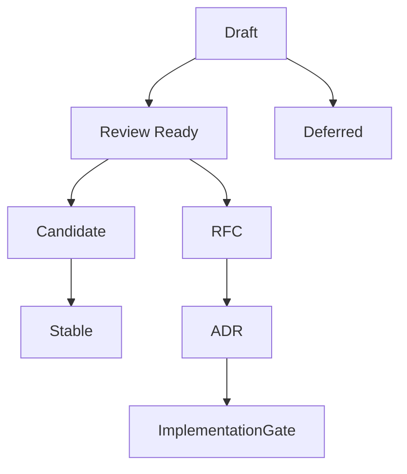

# Sprint 001 Specification Maturity Matrix

## Purpose

This document records the Sprint 001 maturity assessment for the official OpenContextPlatform specifications.

## Goals

- Assess all eight official specifications consistently.
- Identify the gaps that block implementation.
- Connect each specification to the next RFC needed for review readiness.
- Preserve the Sprint 001 rule that specification work precedes runtime code.

## Architecture

Specification maturity is evaluated against the OpenContextPlatform lifecycle. A specification is not implementation-ready until it defines normative behavior, interfaces, compatibility expectations, security concerns, examples, diagrams, tradeoffs, future work, and conformance expectations.

## Diagrams

## Examples

The Context Specification is a foundational draft because it defines the concept and architecture, but it still needs schema, identity rules, lifecycle states, policy semantics, and conformance fixtures before implementation can begin.

### Maturity Levels

| Level | Meaning | Implementation Allowed |
| --- | --- | --- |
| Draft | Directional document exists, but normative contract is incomplete | No |
| Review Ready | Normative scope, examples, security notes, and compatibility impact are defined | No |
| Candidate | Accepted by RFC and ADR with schema and conformance plan | Limited scaffolding only |
| Stable | Versioned contract with compatibility and conformance tests | Yes |
| Deferred | Intentionally postponed or blocked | No |

### Matrix

| Specification | Current Level | Primary Gaps | Key Risks | Dependencies | Recommended Next RFC |
| --- | --- | --- | --- | --- | --- |
| Context | Draft | JSON Schema, identity rules, lifecycle states, policy model, relationship taxonomy, canonical hashing | Weak context identity would break retrieval, memory, ranking, and prompt citations | API versioning, security model, conformance strategy | RFC-002 Context Object Contract |
| Memory | Draft | memory scopes, consent, retention, decay, invalidation, conflict resolution, compaction rules | Unsafe or stale memory could leak data or mislead agents | Context contract, security model, retrieval architecture | RFC-003 Memory Model and Lifecycle |
| Provider | Draft | provider port taxonomy, capability negotiation, error taxonomy, health checks, retry and streaming rules | Vendor leakage into runtime APIs and SDKs | Plugin lifecycle, API versioning, conformance strategy | RFC-004 Provider Port Architecture |
| Connector | Draft | sync modes, checkpoints, webhook flow, deletion propagation, permission mapping, rate-limit behavior | Source authorization may be lost during ingestion | Context contract, plugin lifecycle, security model | RFC-005 Connector Sync and Permissions |
| Plugin | Draft | manifest schema, lifecycle hooks, isolation model, signing, compatibility ranges, marketplace metadata | Unsafe third-party plugins or incompatible provider loading | Security model, provider architecture, connector architecture | RFC-006 Plugin Lifecycle and Isolation |
| Retrieval | Draft | query DSL, planner model, pagination, streaming, cache rules, latency and cost budgets | Hybrid retrieval can be slow, inconsistent, or authorization unsafe | Context contract, provider architecture, ranking model | RFC-007 Retrieval Query Planning |
| Ranking | Draft | score normalization, feature model, explanations, reranker contract, feedback and evaluation hooks | Non-explainable ranking limits enterprise trust and testability | Retrieval architecture, context contract, conformance strategy | RFC-008 Ranking and Explanation Contract |
| Prompt Builder | Draft | prompt package schema, token accounting, template rules, citation format, redaction records | Prompt assembly may leak unauthorized context or become provider-specific | Context contract, ranking contract, security model | RFC-009 Prompt Package Contract |

### Sprint 001 Decision

All official specifications remain Draft during this sprint. Sprint 001 should not promote any specification to Review Ready until RFC backlog, ADR backlog, review checklist, conformance strategy, and security checklist are complete.

## Tradeoffs

Keeping every specification in Draft may look conservative, but it prevents the project from treating descriptive documents as normative contracts. The tradeoff is slower implementation in exchange for cleaner API and ecosystem foundations.

## Future Work

Future iterations should expand each recommended RFC, define schemas and conformance fixtures, and establish a versioned stability policy before any runtime behavior is implemented.
