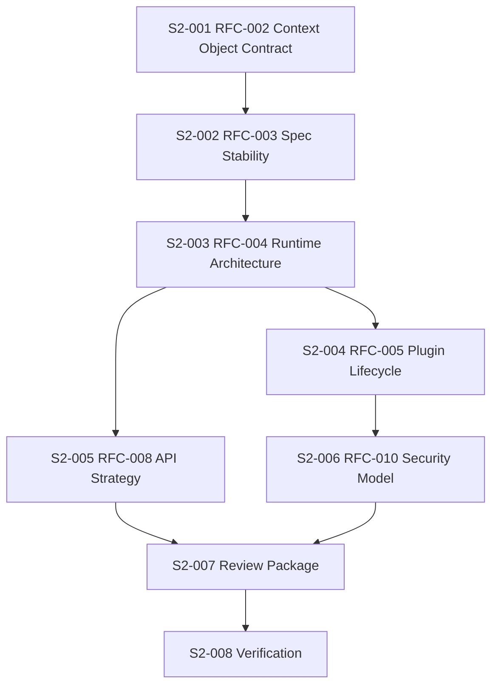

# Sprint 002 Implementation Tasks

## Purpose

This document defines Sprint 002 implementation tasks. In this sprint, implementation means drafting RFCs, updating planning artifacts, and verifying documentation only.

## Goals

- Make Sprint 002 tasks executable without implementation decisions.
- Define outputs, dependencies, and acceptance criteria.
- Keep runtime code blocked until RFCs are reviewed and ADRs are accepted.

## Architecture

Sprint 002 tasks build the architecture decision chain from context contract to runtime architecture, plugin lifecycle, API strategy, and security model.

## Diagrams

## Examples

| ID | Task | Output | Acceptance Criteria |
| --- | --- | --- | --- |
| S2-001 | Draft Context Object Contract RFC | `rfcs/0002-context-object-contract.md` | Defines identity, content, metadata, provenance, policy, relationships, lifecycle, compatibility, examples, and conformance expectations |
| S2-002 | Draft Specification Stability RFC | `rfcs/0003-specification-stability-and-versioning.md` | Defines maturity levels, normative language, versioning, compatibility, deprecation, and promotion gates |
| S2-003 | Draft Runtime Architecture RFC | `rfcs/0004-runtime-architecture.md` | Defines domain, application, ports, adapters, events, control plane, and data plane boundaries |
| S2-004 | Draft Plugin Lifecycle RFC | `rfcs/0005-plugin-lifecycle-and-isolation.md` | Defines manifest, discovery, validation, configuration, lifecycle hooks, health states, isolation, and signing |
| S2-005 | Draft API Strategy RFC | `rfcs/0008-api-versioning-and-schema-strategy.md` | Defines OpenAPI, JSON Schema, protobuf posture, errors, pagination, idempotency, and SDK generation strategy |
| S2-006 | Draft Security Model RFC | `rfcs/0010-security-model.md` | Defines authn, authz, tenancy, connector permissions, prompt safety, audit, secrets, and supply chain posture |
| S2-007 | Produce Sprint 002 review package | `.ai/loops/sprint-002-runtime-architecture/outputs/sprint-002-review-package.md` | Summarizes completed RFCs, risks, unresolved decisions, and ADR recommendations |
| S2-008 | Verify Sprint 002 | `.ai/loops/sprint-002-runtime-architecture/PROGRESS.md` | Required-section check passes and no implementation files exist |

## Tradeoffs

The task list drafts several RFCs before implementation. This is deliberate because these RFCs define the contracts future runtime code must obey.

## Future Work

After Sprint 002, maintainers should review RFCs and record accepted ADRs before runtime scaffolding begins.
