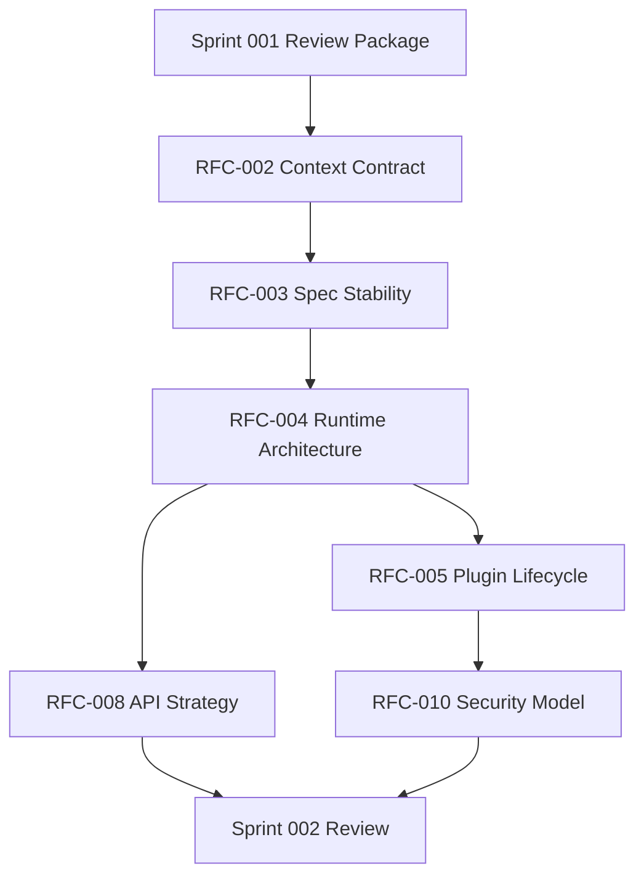

# Sprint 002: Runtime Architecture RFCs

## Purpose

Sprint 002 turns the Sprint 001 documentation foundation into reviewable RFCs for runtime architecture readiness.

## Goals

- Draft the RFCs that unblock runtime architecture decisions.
- Keep implementation blocked until RFC review and ADR acceptance.
- Establish context contract, specification stability, runtime boundaries, plugin isolation, API strategy, and security posture.
- Preserve the canonical layered architecture in README and architecture docs.

## Architecture

Sprint 002 is an RFC and architecture sprint. It uses the loop artifacts under `.ai/loops/sprint-002-runtime-architecture/` and follows the required lifecycle through RFC, architecture, API design, sequence diagrams, tests, documentation, review, and release planning before implementation.

## Diagrams

## Examples

Sprint 002 may draft RFCs, update backlogs, add review packages, and record progress. It must not create runtime packages, provider adapters, connector plugins, SDKs, deployment manifests, migrations, or executable tests.

## Tradeoffs

This sprint delays runtime code in favor of decision-quality RFCs. That keeps the platform extensible and avoids accidental public contracts.

## Future Work

After Sprint 002 review, accepted RFCs should produce ADRs and only then implementation task plans for runtime scaffolding.
