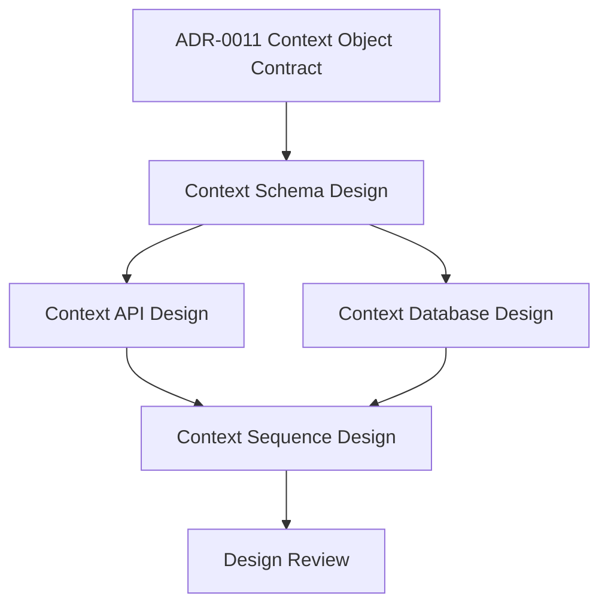

# Sprint 003: Context Design Gates

## Purpose

Sprint 003 completes the context design gates required before runtime scaffolding.

## Goals

- Translate the accepted Context Object Contract into schema, API, database, and sequence design documents.
- Keep implementation blocked until design review is complete.
- Preserve provider neutrality, connector extensibility, security, and conformance readiness.

## Architecture

Sprint 003 follows the required lifecycle after RFC and ADR approval: database design, API design, sequence diagrams, then implementation planning. The sprint produces design artifacts only.

## Diagrams

## Examples

The sprint may define field groups, lifecycle transitions, persistence models, API endpoint shapes, and ingestion or retrieval flows. It must not add JSON Schema files, OpenAPI files, migrations, runtime modules, or executable tests.

## Tradeoffs

Designing before scaffolding delays code, but it prevents runtime packages from encoding accidental schema, persistence, or API choices.

## Future Work

After design review, the project can plan runtime scaffolding and machine-readable schemas as a separate milestone.
