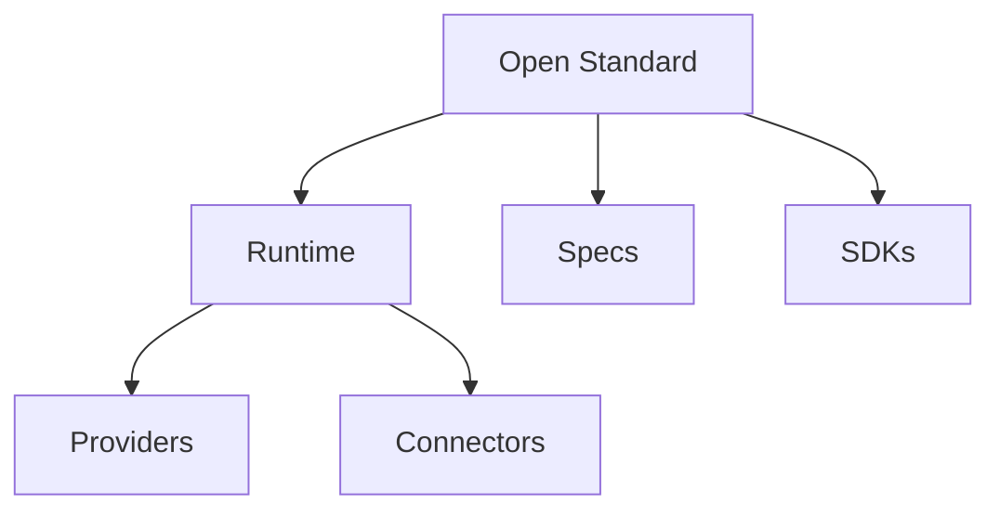

# Vision

## Purpose

OpenContextPlatform aims to become the open standard for AI context infrastructure.

## Goals

- Make context portable across models, databases, clouds, and applications.
- Give enterprises control over context governance and data boundaries.
- Enable an ecosystem of interoperable providers, connectors, SDKs, and tooling.

## Architecture

The vision depends on a stable domain core, explicit extension points, cloud-native deployment, and conformance-tested specifications.

## Diagrams

## Examples

A coding agent can use OpenContextPlatform for repository context while an enterprise assistant uses the same runtime contracts for Jira, Slack, and Confluence knowledge.

## Tradeoffs

Provider neutrality means the platform cannot assume a single best database or model. The architecture must make capabilities discoverable rather than implicit.

## Future Work

The vision will be refined through public RFCs, ecosystem feedback, and conformance results.
