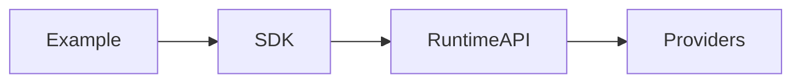

# Examples

## Purpose

This directory will contain runnable examples once runtime and SDK APIs exist.

## Goals

- Demonstrate realistic workflows.
- Keep examples synchronized with specs and SDKs.
- Provide testable reference integrations.

## Architecture

Examples should depend on public SDKs and documented deployment paths, never private runtime internals.

## Diagrams

## Examples

Future examples may include coding-agent context, enterprise knowledge retrieval, connector ingestion, prompt building, and provider replacement.

## Tradeoffs

Examples can become stale if they are not tested. Future examples must be included in CI.

## Future Work

Examples will be added after stable APIs and SDKs are available.
