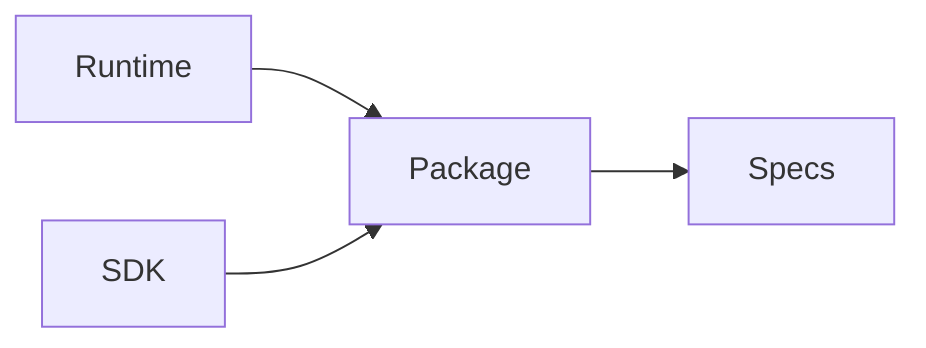

# Packages

## Purpose

This directory will contain shared first-party packages that are not standalone apps, providers, connectors, or SDKs.

## Goals

- Share stable utilities only when they have clear ownership.
- Avoid premature common libraries.
- Keep package boundaries aligned with specifications.

## Architecture

Packages must depend inward toward stable contracts and avoid circular dependencies.

## Diagrams

## Examples

Future packages may include schema definitions, conformance fixtures, protocol types, or documentation tooling.

## Tradeoffs

Shared packages can reduce duplication but can also become dumping grounds. New packages require explicit ownership.

## Future Work

Package taxonomy and build tooling will be decided by ADR.
