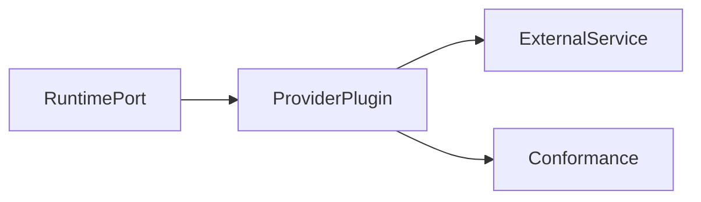

# Providers

## Purpose

This directory will contain first-party provider plugins and provider conformance assets.

## Goals

- Support pluggable LLM, embedding, graph, vector, storage, cache, authentication, and authorization providers.
- Keep provider code out of the runtime core.
- Make provider compatibility testable.

## Architecture

Providers implement runtime ports and declare capabilities through plugin manifests.

## Diagrams

## Examples

Future provider families may target PostgreSQL, Redis, OpenSearch, vector databases, graph databases, and LLM APIs.

## Tradeoffs

Provider plugins introduce compatibility management. The payoff is user choice and reduced vendor lock-in.

## Future Work

Provider implementation waits for the Provider Specification and Plugin Specification to reach an accepted stability level.
