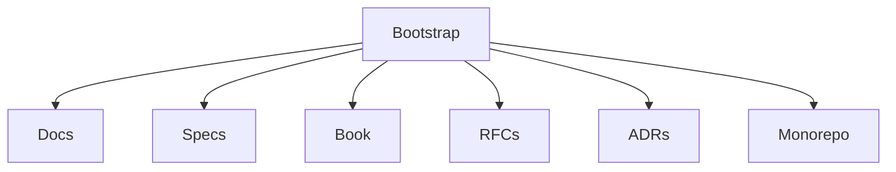

# RFC 0001: Documentation-First Bootstrap

## Purpose

This RFC defines the initial repository bootstrap for OpenContextPlatform.

## Goals

- Create the monorepo structure.
- Establish documentation, specifications, book, RFCs, ADRs, governance, and contribution rules.
- Explicitly defer business logic implementation.

## Architecture

The bootstrap creates top-level ownership boundaries for apps, runtime, packages, providers, connectors, SDKs, deployments, examples, tests, scripts, docs, specs, RFCs, ADRs, and the architecture book.

## Diagrams

## Examples

The Context Specification is created as a normative contract. Runtime code is not created until runtime RFCs, API design, sequence diagrams, and tests are accepted.

## Tradeoffs

The project delays executable functionality. The benefit is a stable architecture foundation for a future open standard.

## Future Work

Follow-up RFCs will cover runtime boundaries, plugin lifecycle, provider SDKs, connector SDKs, persistence, and deployment architecture.
