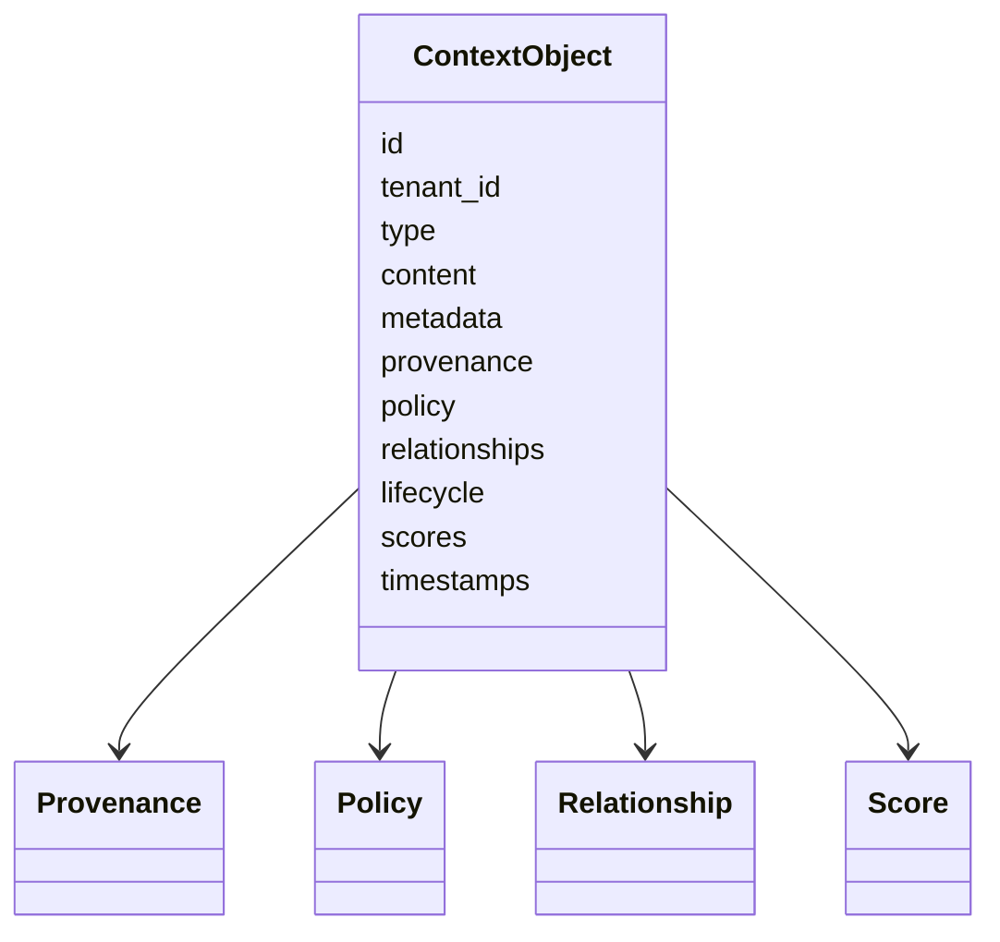

# RFC 0002: Context Object Contract

## Purpose

This RFC proposes the first normative contract for OpenContextPlatform context objects.

## Goals

- Define the required semantic shape of a context object.
- Establish identity, content, metadata, provenance, policy, relationship, lifecycle, and scoring expectations.
- Unblock runtime architecture, retrieval, ranking, memory, connector, provider, and prompt builder RFCs.
- Keep implementation blocked until this RFC is reviewed and an ADR is accepted.

## Architecture

A context object is the portable domain unit that travels through connectors, enrichment, memory, retrieval, ranking, prompt building, audit, and provider adapters. Storage providers may persist it differently, but public APIs and conformance tests must preserve its semantics.

## Diagrams

## Examples

A source file chunk context object includes a stable object id, tenant id, repository provenance, commit reference, path metadata, source permission policy, symbol relationships, lifecycle state, and optional retrieval or ranking scores.

### Proposed Contract Areas

| Area | Required Semantics |
| --- | --- |
| Identity | Stable id, tenant boundary, source id, optional parent id, and canonical hash strategy |
| Type | Explicit context type such as document, code, issue, message, row, memory, graph node, or event |
| Content | Payload reference or inline content with media type, encoding, language, and size metadata |
| Metadata | Structured attributes for filtering, display, routing, and provider-specific extensions |
| Provenance | Source system, connector, actor, timestamp, version, lineage, and transformation history |
| Policy | Access control, tenancy, retention, redaction, allowed use, and audit requirements |
| Relationships | Parent, child, reference, dependency, mention, duplicate, derived-from, and graph edge links |
| Lifecycle | Created, active, stale, superseded, deleted, redacted, archived, and derived states |
| Scores | Retrieval, ranking, confidence, freshness, authority, and explanation records |

### Non-Goals

- This RFC does not define the final JSON Schema.
- This RFC does not choose storage technology.
- This RFC does not implement context ingestion or retrieval.
- This RFC does not define provider-specific wire formats.

### Compatibility Notes

Context identity, policy, provenance, and lifecycle fields are expected to become compatibility-sensitive. Changes to those areas must require RFC review after this contract is accepted.

### Conformance Expectations

Future conformance tests should verify round-trip serialization, permission preservation, provenance preservation, lifecycle transitions, relationship validity, and score explanation shape.

## Tradeoffs

A rich context object is heavier than a simple chunk of text. The cost is justified because enterprise-safe retrieval, prompt assembly, memory, audit, and connector synchronization all require more than raw text.

## Future Work

Future work should define JSON Schema, OpenAPI references, protobuf mapping posture, canonical hashing, lifecycle transition rules, policy schema, and fixtures for context object conformance.
