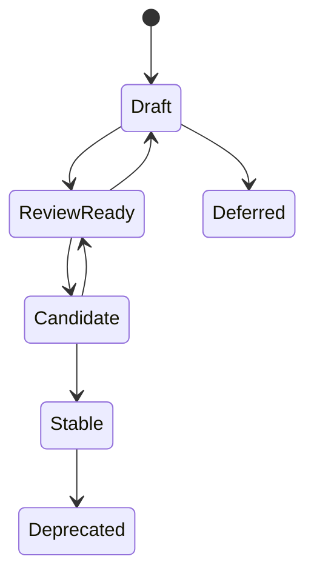

# RFC 0003: Specification Stability and Versioning

## Purpose

This RFC proposes stability levels, versioning rules, and promotion gates for OpenContextPlatform specifications.

## Goals

- Define how specifications move from Draft to Stable.
- Establish compatibility expectations before runtime implementation.
- Define normative language rules.
- Create a shared standard for RFC, ADR, schema, conformance, and release review.

## Architecture

Specification stability is a governance layer over RFCs, ADRs, schemas, tests, SDKs, providers, connectors, and releases. A specification cannot drive implementation until it has enough review evidence for its target maturity level.

## Diagrams

## Examples

The Context Specification can become Review Ready when RFC-002 is reviewed, open questions are recorded, and schema work is scoped. It can become Candidate only after an ADR accepts the contract and conformance expectations are defined.

### Proposed Stability Levels

| Level | Meaning | Required Evidence |
| --- | --- | --- |
| Draft | Directional design exists, but normative contract is incomplete | Purpose, goals, architecture, examples, tradeoffs, future work |
| Review Ready | Maintainers can review the contract for acceptance | RFC draft, open questions, security notes, compatibility notes, conformance expectations |
| Candidate | Implementation planning may begin under constraints | Accepted RFC, ADR, schema plan, conformance strategy, migration notes |
| Stable | Implementations may rely on the contract | Versioned schema, conformance tests, compatibility policy, release notes |
| Deferred | Work is intentionally postponed | Deferral rationale and revisit trigger |
| Deprecated | Stable contract is being replaced | Replacement path, migration plan, removal timeline |

### Normative Language

After a specification reaches Review Ready, it should use these terms consistently:

- MUST for mandatory behavior.
- MUST NOT for prohibited behavior.
- SHOULD for recommended behavior with allowed exceptions.
- MAY for optional behavior.

### Versioning Rules

Specifications should use semantic versioning after they become Candidate. Breaking semantic changes require a major version, compatibility notes, migration guidance, and release communication.

### Promotion Rules

No specification may become Candidate without:

- An accepted RFC.
- An ADR recording the decision.
- A conformance strategy.
- Security review for trust-boundary impact.
- Compatibility notes.

No specification may become Stable without:

- Versioned schemas or equivalent machine-readable contracts.
- Executable conformance tests.
- Documentation examples.
- Release notes.

### Non-Goals

- This RFC does not define package versioning.
- This RFC does not define cloud release trains.
- This RFC does not approve any current Draft specification as Review Ready.

## Tradeoffs

Formal stability levels slow early development. The tradeoff is necessary because provider authors, connector authors, SDK maintainers, and enterprise operators need to know which contracts they can rely on.

## Future Work

Future work should create ADR-002, update the specification maturity matrix, add status headers to every specification, and create CI checks for required stability evidence.
