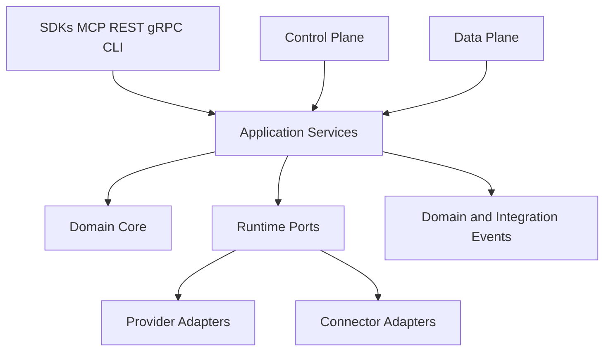

# RFC 0004: Runtime Architecture

## Purpose

This RFC proposes the architecture boundaries for the OpenContextPlatform runtime.

## Goals

- Define domain, application, port, adapter, event, control plane, and data plane responsibilities.
- Align runtime architecture with the canonical layered platform architecture.
- Keep runtime code blocked until architectural decisions are reviewed and recorded in ADRs.
- Establish the foundation for provider, connector, API, security, and conformance work.

## Architecture

The runtime should follow Clean Architecture and Hexagonal Architecture. The domain core owns context identity, provenance, policy, relationships, lifecycle, and invariant rules. Application services orchestrate use cases. Ports define required capabilities. Adapters connect providers, connectors, APIs, event systems, and storage.

## Diagrams

## Examples

Retrieval orchestration belongs in application services. Context identity belongs in the domain core. Vector search belongs behind provider ports. GitHub, Jira, Slack, filesystem, SQL, REST, and MCP ingestion belongs behind connector ports.

### Proposed Runtime Boundaries

| Boundary | Responsibility | Must Not Own |
| --- | --- | --- |
| Domain Core | context objects, memory concepts, policy references, lifecycle, relationships, domain events | vendor SDK calls, transport handlers, database queries |
| Application Services | use case orchestration, retrieval planning, memory flows, ranking pipeline coordination, prompt package assembly | provider-specific logic, UI behavior |
| Ports | runtime-required interfaces for providers, connectors, event bus, storage, auth, audit, observability | implementation details |
| Adapters | provider APIs, connector APIs, persistence, cache, queue, stream, external systems | domain invariants |
| Interfaces | SDK, MCP, REST, gRPC, CLI contracts | business rules |
| Control Plane | tenant config, plugin config, policy config, operational lifecycle | high-volume context data flow |
| Data Plane | ingestion, retrieval, ranking, prompt assembly, memory flows | administrative policy ownership |

### Event Model

Runtime events should be domain-first and implementation-neutral. Events include context ingested, context updated, context deleted, memory candidate created, retrieval executed, ranking completed, prompt package assembled, plugin state changed, and policy decision recorded.

### Non-Goals

- This RFC does not choose a programming language or framework.
- This RFC does not create runtime directories or code.
- This RFC does not define database schemas.
- This RFC does not approve provider or connector implementation.

### Open Decisions

- Whether control plane and data plane are separate deployable services in the first runtime release.
- Which event bus semantics are required for the first implementation.
- Whether runtime ports are generated from schemas or handwritten per language.

## Tradeoffs

The boundary model creates more architectural structure than a simple service. The cost is justified because provider neutrality, connector extensibility, enterprise security, and conformance testing all depend on stable seams between domain logic and infrastructure.

## Future Work

Future work should record ADR-004, define sequence diagrams for ingestion and retrieval, create API design documents, define database design, and only then plan runtime scaffolding.
