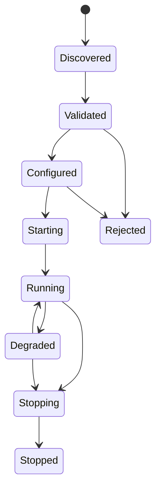

# RFC 0005: Plugin Lifecycle and Isolation

## Purpose

This RFC proposes lifecycle, isolation, compatibility, and trust boundaries for OpenContextPlatform plugins.

## Goals

- Define plugin discovery, validation, configuration, startup, health, degradation, shutdown, and upgrade behavior.
- Establish isolation and signing expectations before provider or connector plugins exist.
- Support provider, connector, ranking, storage, cache, authentication, authorization, and future plugin categories.
- Keep plugin implementation blocked until security review and ADR acceptance.

## Architecture

Plugins extend runtime ports. The runtime owns plugin lifecycle orchestration, configuration, compatibility checks, health observation, policy enforcement, and shutdown. Plugins declare capabilities through manifests and must not bypass domain, policy, tenant, or audit boundaries.

## Diagrams

## Examples

A vector database provider plugin declares supported distance metrics, filter dialect support, index lifecycle capabilities, health checks, configuration schema, required secrets, and compatibility with runtime and provider specification versions.

### Proposed Plugin Contract

| Area | Required Semantics |
| --- | --- |
| Manifest | plugin id, name, version, category, supported spec versions, runtime compatibility, capabilities, config schema |
| Discovery | deterministic plugin registry or configured path/source |
| Validation | manifest validation, compatibility check, signature or trust policy check |
| Configuration | typed config, secret references, tenant scope, policy constraints |
| Lifecycle | initialize, start, health, reload, degrade, stop, dispose |
| Isolation | process, sandbox, WASM, or restricted in-process model selected by ADR |
| Observability | health state, metrics, logs, traces, audit events without secret leakage |
| Failure | timeout, retry, circuit breaker, degradation, disable, rollback |

### Security Requirements

Plugins must not receive raw secrets unless required by their adapter role. Plugins must not write context, memory, audit, or policy state except through runtime-approved ports. Third-party plugins require explicit trust decisions before production use.

### Non-Goals

- This RFC does not choose the final isolation mechanism.
- This RFC does not define marketplace distribution.
- This RFC does not implement plugin loading.
- This RFC does not define all provider or connector capabilities.

### Open Decisions

- First supported isolation model.
- Plugin signing and provenance requirements for local development versus production.
- Whether plugin manifests are JSON Schema, OpenAPI extensions, or a dedicated schema format.

## Tradeoffs

Strong isolation and compatibility checks add operational cost. The cost is necessary because OpenContextPlatform is expected to run third-party providers and connectors that touch sensitive enterprise data.

## Future Work

Future work should record ADR-005, update the Plugin Specification, define manifest schema, define security conformance fixtures, and draft provider and connector SDK RFCs.
