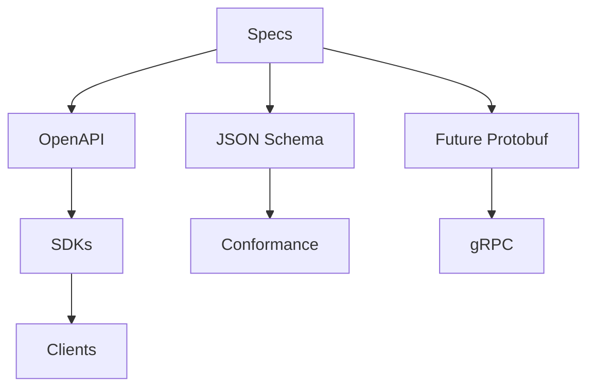

# RFC 0008: API Versioning and Schema Strategy

## Purpose

This RFC proposes the API versioning and schema strategy for OpenContextPlatform.

## Goals

- Define how public APIs, schemas, SDKs, and conformance tests stay aligned.
- Establish the role of OpenAPI, JSON Schema, protobuf, errors, pagination, idempotency, and compatibility.
- Keep API implementation blocked until contract strategy is accepted.

## Architecture

API contracts should derive from specifications. REST APIs should be described with OpenAPI. Shared object contracts should use JSON Schema where practical. gRPC and protobuf may be introduced where streaming, strongly typed service boundaries, or high-performance integrations justify the cost.

## Diagrams

## Examples

A retrieval API should reference the Context Object Contract, Retrieval Specification, Ranking Specification, and error taxonomy. SDKs should be generated or validated against the same contract rather than hand-maintaining divergent shapes.

### Proposed API Rules

| Area | Proposed Rule |
| --- | --- |
| Versioning | Version public APIs explicitly and bind breaking changes to specification stability policy |
| Schema | Use JSON Schema for context objects and common domain shapes |
| REST | Use OpenAPI for HTTP APIs |
| gRPC | Defer protobuf until streaming or service-to-service performance requirements are accepted |
| Errors | Define stable error codes, human messages, retryability, correlation ids, and policy denial details |
| Pagination | Use consistent cursor-based pagination for list and search APIs |
| Idempotency | Require idempotency keys for mutation commands that may be retried |
| SDKs | Generate or contract-test SDKs from public schemas |
| Compatibility | Track breaking, additive, deprecated, and experimental fields |

### Non-Goals

- This RFC does not write OpenAPI files.
- This RFC does not generate SDKs.
- This RFC does not implement REST, gRPC, MCP, or CLI handlers.
- This RFC does not select a final protobuf package layout.

### Open Decisions

- Whether JSON Schema or OpenAPI schemas are the source of truth for shared domain objects.
- Error taxonomy structure.
- API version path or header strategy.
- SDK generation tooling.

## Tradeoffs

API-first development adds up-front schema design work, but it enables SDK generation, compatibility testing, conformance suites, and enterprise review before runtime code ships.

## Future Work

Future work should record ADR-003, create schema directories, define an error taxonomy RFC, draft OpenAPI skeletons after runtime RFC review, and connect schemas to conformance tests.
