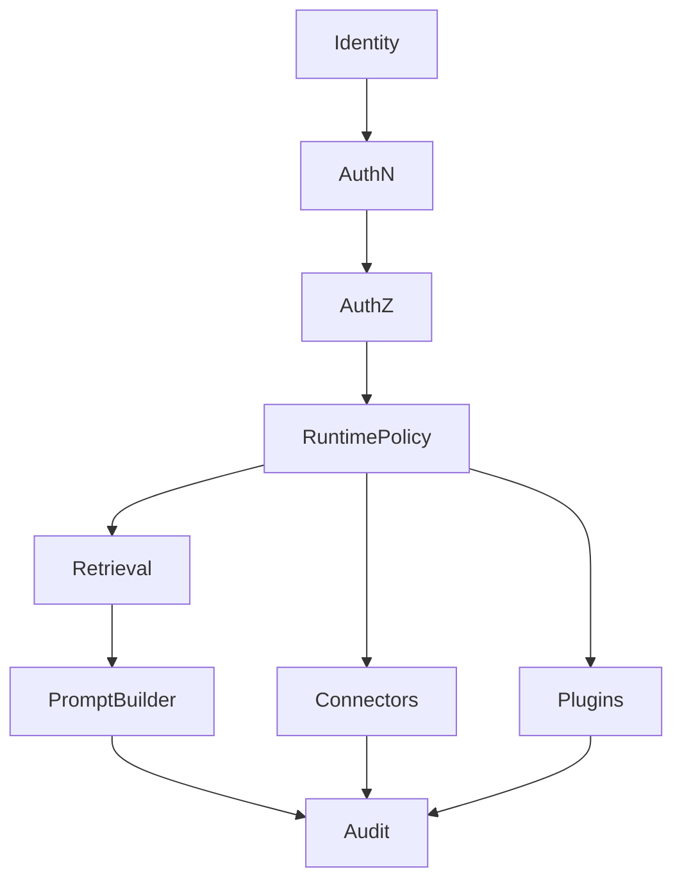

# RFC 0010: Security Model

## Purpose

This RFC proposes the initial security model for OpenContextPlatform.

## Goals

- Define authentication, authorization, tenancy, connector permissions, plugin trust, prompt safety, secrets, audit, and supply chain expectations.
- Identify implementation blockers before runtime, connector, provider, memory, or prompt code exists.
- Align security posture with enterprise requirements and the security review checklist.

## Architecture

Security is a cross-cutting platform capability. It must be enforced at interfaces, application services, domain policy references, provider adapters, connector adapters, plugin lifecycle, storage, events, and observability. Source permissions must survive ingestion, retrieval, ranking, prompt assembly, memory derivation, and audit.

## Diagrams

## Examples

A Slack message ingested as context must preserve workspace, channel, user, and sharing permissions. Retrieval must filter the object for unauthorized users before ranking. Prompt building must cite the object only if the caller is authorized to see it.

### Proposed Security Domains

| Domain | Required Semantics |
| --- | --- |
| Authentication | user, service, connector, provider, and plugin identities |
| Authorization | tenant, organization, project, source, object, and operation-level policy checks |
| Tenancy | hard tenant boundaries across API, storage, cache, events, logs, and providers |
| Connector Permissions | source ACL capture, updates, deletion propagation, and permission drift handling |
| Plugin Trust | manifest validation, signing policy, isolation, runtime permissions, disable and rollback |
| Prompt Safety | prompt injection boundaries, redaction, citations, trusted instruction separation |
| Secrets | secret references, rotation, redaction, audit-safe logging, no secrets in context payloads |
| Audit | policy decisions, retrieval decisions, connector sync, plugin lifecycle, prompt package assembly |
| Supply Chain | dependencies, images, plugin artifacts, SBOM, signatures, provenance |

### Escalation Rules

Implementation must stop and escalate if:

- Source permissions cannot be represented.
- A plugin trust boundary is unclear.
- Prompt assembly can mix untrusted retrieved content with privileged instructions.
- Tenant isolation depends on caller convention rather than enforced policy.
- Secrets would appear in logs, prompts, tests, examples, or context objects.

### Non-Goals

- This RFC does not select a specific identity provider.
- This RFC does not implement RBAC or ABAC.
- This RFC does not define final audit schema.
- This RFC does not approve production plugin execution.

### Open Decisions

- RBAC, ABAC, or hybrid policy model for first runtime release.
- Audit event schema and retention expectations.
- Secret manager abstraction and local development fallback.
- Prompt injection mitigation requirements for Candidate stability.

## Tradeoffs

Security as a first-class architecture concern increases design effort and may add runtime latency. The tradeoff is mandatory because the platform handles private enterprise context, long-term memory, plugins, connectors, and model prompts.

## Future Work

Future work should record ADR-009, define threat model templates, update connector and plugin specifications, define audit schema, and create security conformance fixtures after RFC review.
