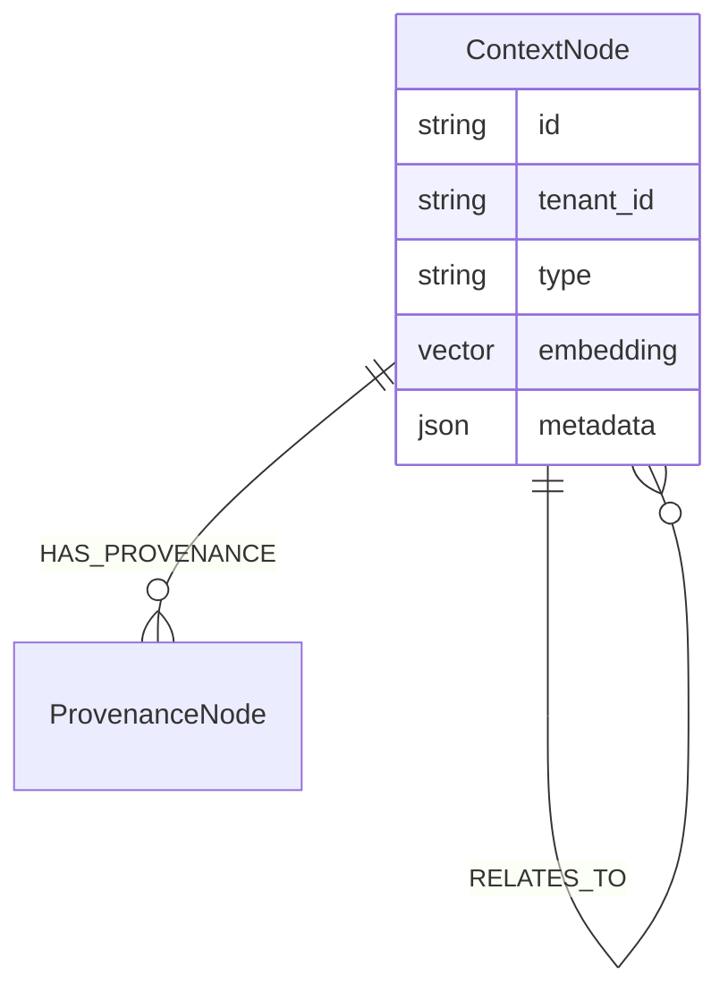

# RFC 0011: ArcadeDB Unified Schema Design

## Purpose

This RFC proposes the unified schema design for OpenContextPlatform using ArcadeDB as the primary, multi-modal database engine.

## Goals

- Define the schema for storing relational, document, vector, and graph data in a single ArcadeDB instance.
- Ensure the Context Object Contract (RFC 0002) maps efficiently to the database layer.
- Provide a scalable foundation for hybrid search (vector + graph).

## Architecture

ArcadeDB supports SQL, Cypher, and Gremlin. We will utilize Document types for generic metadata, Graph Vertex/Edge types for relational entity mapping, and Vector properties for embeddings.

### Proposed Schema Mapping

| Context Dimension | ArcadeDB Type | Description |
|-------------------|---------------|-------------|
| **Core Identity** | `Document` (`ContextNode`) | Stores `id`, `tenant_id`, `type`, and lifecycle states. |
| **Metadata** | `Document` Properties | JSON schema mapped properties for fast SQL/Document queries. |
| **Embeddings** | `Vector` Property | Stored on the `ContextNode` as a vector index (`HNSW`). |
| **Relationships** | `Edge` | Edges representing parent, child, derived-from, and semantic links. |
| **Provenance** | `Document` (`ProvenanceNode`) | Linked via `HAS_PROVENANCE` edge to preserve source history. |

## Diagrams

## Tradeoffs

Using a unified database simplifies operational overhead but tightly couples our core storage. The Provider SDK layer will ensure this is abstracted away, but ArcadeDB will be the default out-of-the-box engine.

## Future Work

Future sprints will implement the actual driver connections and migration scripts.
